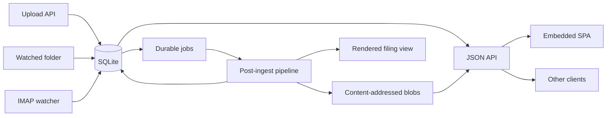

Suchi is one statically linked Go binary with an embedded Svelte application.
SQLite, content-addressed blobs, and generated filesystem views live under one
`DATA_DIR`. The core runtime needs no database server, cache, or message broker.
Optional document tools and configured network integrations sit outside that
core.

## Repository boundaries

| Path | Responsibility |
| --- | --- |
| `core/` | Application services, storage, pipeline, API, and server-rendered entry pages |
| `plugin-api/` | Small shared interfaces and value types |
| `plugins/` | Compile-linked authentication, subscriber, and audit implementations |
| `distro/cmd/suchi/` | CLI and dependency wiring |
| `ui/` | Svelte source embedded into the binary |
| `hack/` | Development, fixture, and benchmark tooling |

Keep domain behavior in an existing `core` package when it shares that
package's ownership. Add a package only for a distinct responsibility. A
feature is a plugin when operators may replace or omit the implementation, not
simply because it is optional.

## Data flow



All ingest producers create the document and its first job together. The
pipeline identifies the format, normalizes or extracts content when tooling is
available, writes derived blobs and metadata, then schedules classification,
automation, rendering, or approval work. Missing optional tools degrade the
result; they do not discard the original upload.

Acquisition provenance is stored separately from document identity. The same
owner and content hash resolve to one document and one CAS blob, while distinct
uploads, mailbox folders, watched paths, and imports become `document_sources`
rows. Mailbox rows keep the name, address, and folder observed at ingest plus a
nullable reference to the configured mailbox. The detail API uses the current
mailbox name while that account exists and falls back to the recorded name
after deletion. Exact repeats from the same mailbox and folder are ignored.
Split pages and email attachments inherit their parent's sources; versions
record their own upload source. Sources never stand in for version chains or
document links.

## Storage and concurrency

`core/db` opens separate pools against one SQLite file:

- `DB.Write` has one connection. Mutations use `WriteTx`, which serializes
  writers inside the process.
- `DB.Read` serves concurrent reads while WAL mode allows the writer to
  continue.

SQLite pragmas are applied by the DSN and include WAL, foreign keys, a busy
timeout, and bounded memory mapping. Migrations under `core/db/migrations/` are
embedded, numbered, and applied at boot. Applied migrations are immutable;
schema corrections use a new migration.

Original and derived bytes are immutable CAS objects addressed by SHA-256:

```text
$DATA_DIR/blobs/sha256/ab/cd/ef/<full-hash>
```

Writes stream through a same-directory temporary file and finish with an
atomic rename. Database rows reference the blobs. The rendered Johnny.Decimal
tree is a rebuildable projection, not another source of truth.

## Durable work

The `jobs` table is Suchi's queue. Producers enqueue in the same transaction as
the state change that requires work. The dispatcher claims ready rows, invokes
registered subscribers, retries failures with backoff, and parks exhausted
jobs as `dead`. Running internal jobs are reclaimed after an interrupted
process.

Subscribers must be idempotent and respect context cancellation. Network calls
and subprocess work happen after the producer transaction commits.

Common job families include:

| Family | Owner |
| --- | --- |
| `postingest:*` | Document normalization and extraction |
| `classify:*` | Optional LLM classification |
| `render:*` | Filesystem-view updates |
| `approval:*` | Approval advancement and timeout sweeps |

## HTTP, authentication, and authorization

The standard JSON surface is `/api/*`; the embedded application consumes the
same endpoints as external clients. List responses use the documented JSON
envelopes in [HTTP API](/api).

Requests pass through request-ID, logging, authentication, scope, and
authorization layers; the Go HTTP server contains handler panics. Authentication establishes a principal through local
sessions or tokens and optional OIDC. Authorization then applies roles, groups,
object ACLs, ownership, and sensitivity rules.

List and search handlers put visibility constraints inside SQL. Post-filtering
would leak counts or break pagination. Mutations emit audit events after their
state change succeeds; audit JSON never includes document content or secrets.

Secrets such as mailbox credentials and OAuth caches, PDF passwords, and LLM API
keys are sealed with the generated key under `DATA_DIR`. API tokens
and browser session identifiers are stored as digests. The operator must back
up the whole data directory, not only the database.

## Processing boundaries

External parsers run through `core/sandbox` with a controlled environment,
timeouts, output limits, temporary working directories, and process-group
cleanup. Upload limits are enforced before work is scheduled.

Preview and download routes enforce document view permission before reading a
blob. High-sensitivity previews additionally require an explicit reveal.
Session-authenticated mutations reject cross-site requests through Fetch
Metadata checks, and UI responses set CSP, frame, and content-type protections.

## Classification and workflows

- **Archive matching** learns unresolved filing metadata from visible similar documents.
- **Automations** provide deterministic classification through typed triggers and ordered actions.
- **Approvals** model human decisions that directly control a system action,
  including low-confidence metadata suggestions.
- **LLM classification** is an optional fixed post-extraction subscriber with
  explicit egress acknowledgement.

These mechanisms share the durable job and audit infrastructure while keeping
network calls outside automation transactions and human decisions explicit.

## Extension points

`plugin-api` defines the stable shared vocabulary:

- `Authenticator` adds an authentication source.
- `Subscriber` consumes durable jobs.
- `AuditSink` receives audit events for external export.

Plugins are compiled into a distribution; Suchi does not load arbitrary Go
shared objects at runtime. Format extractors and core workflow actions remain
ordinary `core` packages when they are part of the shipped product.

## Invariants

Changes should preserve these properties:

- one in-process SQLite writer and no writes through the read pool
- bound SQL values and allow-listed dynamic identifiers
- immutable CAS writes with same-filesystem atomic replacement
- document visibility applied inside list, search, and similar-document queries
- durable work enqueued with the mutation that requires it
- retry-aware subscribers with explicit deduplication where side effects need
  it, plus bounded subprocess execution
- sealed credentials and content-free audit records
- generated views treated as rebuildable projections

## Adding a feature

1. Place behavior in the package that owns the domain; introduce a new package
   only when ownership is distinct.
2. Add a migration for schema changes and enqueue follow-up work transactionally.
3. Apply scopes and object authorization at the handler boundary.
4. Add focused unit or HTTP integration coverage with a temporary database.
5. Update the API guide, user documentation, and changelog in the same change.
6. Run `make check`; add `make smoke` or `make bench-check` when the affected
   surface warrants it.

Related references: [configuration](/config), [formats](/formats),
[permissions](/permissions), [automations](/automations),
[approvals](/approvals), and [plugins](/plugins).
