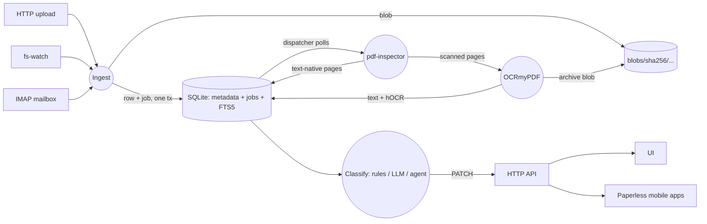
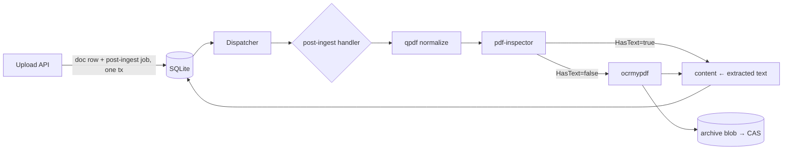

## Layout

Monorepo, multiple Go modules glued by `go.work`. Module boundaries
are the contract, not repo count.

```
suchi/
├── plugin-api/          # interfaces + Event/Principal/BlobRef.
│                        # The ONLY shared dep.
├── core/                # SQLite discipline, HTTP layer, job outbox,
│                        # audit log, auth chain, blob CAS, i18n,
│                        # ingest importer, sandbox, UI.
├── plugins/
│   ├── local-auth/      # first-boot setup token, password login,
│   │                    # API tokens, session cookies
│   └── oidc/            # generic OIDC (any provider)
└── distro/              # the shipped binary. Pins versions, blank-
    └── cmd/suchi/       # imports enabled plugins in the compile-linked
                         # Filestash-style registry.
```

Plugins never touch the core schema directly — every plugin gets
`plugin_kv(plugin_name, key, value_json)` for its scratch space.

## Data flow



## Non-negotiable design principles

Every architectural decision is tested against these.

<AccordionGroup>
  <Accordion title="1. Ultra-lightweight on resources">
    Idle RAM ≤ ~100 MB; ~35 MB slim image; runs on a $5 VPS or a Pi.
  </Accordion>
  <Accordion title="2. Easy to get around">
    One binary, one config, one data dir. `suchi --help` fits on a
    screen. Every knob has an env-var equivalent.
  </Accordion>
  <Accordion title="3. Boring underneath">
    stdlib where possible, SQLite by default, no message broker, no
    cache tier. *Modern is adopted only when it makes the stack more
    boring.*
  </Accordion>
  <Accordion title="4. Batteries included but every battery is swappable">
    Every integration point is an interface in `plugin-api/`.
  </Accordion>
  <Accordion title="5. Every decision is a log line — every unit of work is a row">
    No in-memory-only work queues; the durable outbox table is the
    truth.
  </Accordion>
  <Accordion title="6. Regenerable data layout">
    Blobs + SQLite are the source of truth. Rendered file tree,
    thumbnails, FTS index are all regenerable.
  </Accordion>
  <Accordion title="7. Hostile-input posture">
    PDFs are the malware delivery format. Every parser runs as a
    subprocess with timeouts, rlimits, output caps, no network. See
    `core/sandbox/`.
  </Accordion>
  <Accordion title="8. Your documents, your data">
    No telemetry, ever. Every egress opt-in, visible in config,
    logged. See [privacy](/privacy).
  </Accordion>
  <Accordion title="9. Email is a first-class ingest path">
    Not an add-on. Ships in every default image alongside filesystem
    watch and upload.
  </Accordion>
</AccordionGroup>

## Durable job outbox

Every unit of async work is a row in `jobs`. The dispatcher polls
`jobs_ready` (partial index on `state='pending' AND next_run_at<=now`)
and hands rows to registered subscribers.

- Handlers are **idempotent** — retry semantics assume this.
- Ingest writes the document row AND its `post-ingest` job in the
  **same transaction**. There is no window where a doc exists but its
  work is lost.
- Failures back off exponentially, cap at `attempts=5`, then move to
  `state='dead'`. Dead rows are visible via `/api/tasks/` — the same
  table doubles as the mobile-app tasks endpoint in Phase 4, free.

## SQLite discipline

Two connection pools on the same file:

- **Write pool**: `MaxOpenConns=1` + `BEGIN IMMEDIATE`. One writer,
  serialized at the pool level so `SQLITE_BUSY` is structurally
  impossible.
- **Read pool**: ordinary WAL readers, concurrent with the writer.

Pragmas set in the DSN so the first connection is already correctly
configured: `journal_mode=WAL`, `synchronous=NORMAL`,
`busy_timeout=5000`, `foreign_keys=ON`, `mmap_size=256M`,
`temp_store=MEMORY`.

Migrations are one-way and gated by `PRAGMA user_version`. Down
migrations aren't supported — production rollbacks restore from the
pre-migration snapshot backups take before each schema change.

## Post-ingest pipeline

Every uploaded PDF flows through a fixed chain, hosted by the
`core/pipeline/postingest` Handler and dispatched via the durable
outbox:



Every subprocess in the chain runs via `core/sandbox` — empty env,
no network, hard timeout, bounded output, fresh workdir removed on
return. Every step **degrades gracefully**: if a binary isn't
installed (or the input is unrecognized), the step logs a `skip`
and the pipeline continues with the previous state. The design
principle: ingest completes even when some tools aren't installed.

- **qpdf** strips restrictions + decrypts empty-user-password PDFs
  before ocrmypdf sees them. Absorbs decompression bombs.
- **pdf-inspector / pdftotext** decides whether the PDF has enough
  embedded text to skip OCR entirely (threshold: 32 non-whitespace
  chars). If yes → shortcut writes text into `documents.content`.
- **ocrmypdf** runs only when the shortcut fails. Emits a
  searchable-PDF archive (stored in the CAS as `archive_blob`) and
  a plain-text sidecar (stored in `documents.content`). The FTS5
  trigger picks up the content change automatically.
- **zugferd** (Factur-X / XRechnung / ZUGFeRD) inspects the PDF for
  an embedded invoice XML attachment and, if present, populates
  `invoice_number`, `invoice_date`, `invoice_currency`,
  `invoice_total_gross`, `invoice_total_net`, `invoice_seller`,
  `invoice_seller_vat`, `invoice_buyer` custom fields. The
  `custom_fields` rows are created lazily on the first extraction.
- **epub** ingest is a pure-Go zip walker: reads `META-INF/container.xml`
  → OPF → spine, concatenates the visible text from each XHTML in
  reading order into `documents.content`. No qpdf, no ocrmypdf, no
  external binary — works in the slim image too.
- **djvu** ingest routes through `djvutxt` (djvulibre-bin) which pulls
  the embedded text layer from OCR'd DjVu scans (archive.org / library
  archive workflows). Missing binary → skipped, doc lands with empty
  content and can be re-ingested later.

Rules-engine classification runs after this (Phase 2 later); LLM /
agent classification is Phase 3.

## Workflow engine

Post-ingest pushes a document into a consistent state. What happens
_next_ — the manager sign-off, the finance approval, the escalation
when nobody answers in 24 h — lives in the workflow engine. Definitions
are versioned JSON in `workflow_defs`; each run keeps one
`current_state` cursor in `workflow_runs`; every transition appends to
`workflow_transitions` (audit log); human steps land in
`workflow_tasks`. Advancement rides the same durable outbox as
everything else via `workflow:advance` / `workflow:resume` /
`workflow:timeout-sweep` — no second scheduler. See
[workflows](/workflows) for the spec shape, the six HTTP endpoints,
and a worked invoice-approval example.

## Content-addressed storage

Blobs live at `$DATA_DIR/blobs/sha256/{aa}/{bb}/{full-hash}`. Puts
stream through SHA-256 into a per-put temp file in the destination
shard, fsync, atomic rename. Same-device by construction so the
rename is POSIX-atomic. Duplicate puts return the existing ref
without rewriting — free dedup.

Documents carry two blob references:

- `original_blob` (NOT NULL) — the bytes as ingested. Dedup key.
- `archive_blob` (nullable) — the OCR-rewritten PDF. Regenerable in
  principle; stored because OCR is expensive.
