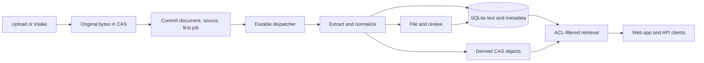

Suchi captures, extracts, files, retrieves and reviews documents locally. Each
step remains useful without an LLM or external service. The production runtime
is one static Go binary with an embedded Svelte app, SQLite, immutable CAS blobs
and rebuildable filing views under `DATA_DIR`; no database server, cache or broker.

This guide describes the checkout, not future proposals in `../specs/`. Confirm
contracts against source/tests. [Frontend architecture](/spa-architecture) owns
browser composition; linked feature guides own detailed user and wire behavior.

## Where to start a change

| Concern | Entry point and owner |
| --- | --- |
| Lifecycle and wiring | `distro/cmd/suchi/main.go: runServe`; `serve_*.go` assembles services and HTTP policy |
| JSON contracts | `core/api/api.go: Server.Register`; feature handlers in `core/api/` |
| Browser/blob delivery | `core/ui/ui.go`, `core/ui/spa.go`; CLI wires API preview/download mirrors |
| Identity/access | `core/auth/`, `core/authz/`, `core/httpx/`; credentials in `plugins/local-auth/`, `plugins/oidc/` |
| Durable state/work | `core/db/db.go`, `core/db/migrations/`, `core/blob/cas.go`, `core/jobs/jobs.go` |
| Capture/processing | `core/api/documents.go: UploadDocument`, `core/ingest/`, `core/importer/bundle/`, `core/pipeline/postingest/` |
| Filing/review/retrieval | `core/jd/`, `core/automations/`, `core/approvals/`, `core/searchquery/`, `core/intelligence/`; API projections in `core/api/` |
| Portable taxonomy | `core/jd/presetfile` validates/normalizes HuML/TOML; `core/jd/importer` previews/applies; `core/taxonomy/exporter` exports |
| Filing projections | `core/render/index` writes tree-only indexes; `core/render/view` owns document paths |

Keep behavior with its domain owner. `plugin-api/` provides vocabulary for
compile-linked authenticators, job subscribers and audit sinks, without a runtime
Go plugin loader or service framework. The CLI injects integration callbacks into
the API instead of importing `plugins/*` there. See [Plugins](/plugins).

`core/approvals/document_change.go` owns review eligibility together with source,
field-generation, access and session validation. The classifier records bounded
review reasons; Suchi's approval transaction performs the final checks and write.
See [Review-first mode](/approvals#review-first-mode).

## Boot and shutdown

Follow `runServe` to diagnose missing runtime wiring:

1. Validate configuration, create `DATA_DIR`, open/migrate SQLite and establish
   Johnny.Decimal Inbox invariants.
2. Construct auth, CAS, rendering, retention, keys and configured integrations.
   Report unavailable optional parsers without failing startup.
3. Register durable subscribers before job reclamation/dispatcher startup; start
   configured intake, backup and retention loops.
4. Inject API/browser dependencies, register routes and wrap the mux in middleware.
5. On termination, cancel the shared context and give HTTP bounded shutdown grace.
   Subscribers and subprocesses honor cancellation.

One server process owns an archive. The writer pool and startup reclamation do
not coordinate multiple servers sharing SQLite.

Build version/revision resolve once at boot and enter authenticated `/api/whoami`
metadata. Docker receives revision explicitly because its context excludes `.git`.
Settings consumes that identity; no update service is involved.

## From upload to usable document



`UploadDocument` requires write scope, enforces the body limit and sniffs content
rather than trusting supplied MIME. It streams original bytes to CAS, then opens
one write transaction to recheck authority, deduplicate by system/owner/hash or
insert the document, record provenance and enqueue system-owned `post-ingest` work.
After commit it nudges dispatch and emits audit. A lost nudge cannot lose the job;
re-uploading a live duplicate records its source without another extraction job.

Post-ingest selects the format path and stores extracted metadata/derived bytes.
The common post-content path performs local matching, automations, filing/thumbnail
refresh and optional `post-classify`. Document/version uploads share
`core/api/upload_prepare.go` for multipart validation, rewind-safe MIME detection,
source attribution, CAS and idempotency fingerprints; each owns its transaction
and authorization. Keyed response receipts commit with document/job in
`upload_idempotency`; subsequent keyed uploads prune receipts older than 30 days.

Device OCR is provisional PDF text subject to configured confidence. Native PDF
text remains authoritative; empty extraction cannot erase accepted device text.
Mail/post-ingest use `core/mimeutil` to refine missing, generic or malformed MIME
from bytes while retaining specific valid source types. Rescans can therefore
repair mislabeled PDFs and reach encryption handling without rewriting originals
or changing the pipeline revision. [Supported formats](/formats) owns dispatch,
format limits and real-tool requirements.

Split extraction/CAS work stays outside the writer. Child insertion then reads the
**current live parent inside the transaction**, inheriting system, owner, category,
title, MIME, source time and sensitivity after any intervening edits. A trashed or
missing parent cannot produce a new visible child. Source copying and the child's
job commit together. Immutable split origins identify completed parts after parent
retirement; retrying retirement does not reset an existing Trash deadline.
See [Scan splitting](/formats#multi-doc-splitting-on-qr-separator-sheets).

Filesystem/IMAP producers use the same document/job transaction pattern. IMAP
checkpoints ascending batches of at most 50 UIDs after import/bookkeeping; failure
stops the cycle while preserving earlier progress, and connection tests do not
clear polling failures. [Mail intake](/guides/mail-intake) owns history/rules/health.
Portable import differs: `core/importer/bundle/` may restore supplied content,
archive bytes and metadata without scheduling extraction.

`document_sources` records acquisition, separately from identity, version chains
and relationships. One system/owner/hash document may have multiple sources, and
different documents/systems may share CAS bytes. Mailbox history preserves the
observed name/folder after account deletion. Split children/email attachments
inherit sources; each version records its own upload.

## Storage and transaction invariants

`DB.Write` has one connection; `DB.Read` has a small pool. Both use the same WAL
SQLite file with foreign keys, busy timeout and bounded mmap. Mutations use
`WriteTx`; participating helpers receive its `*sql.Tx`. Re-entering the writer
from its transaction deadlocks on the held connection. Deferred rollback releases
it after errors or panics, including when callers recover.

Keep network calls, subprocesses and long processing outside write transactions.
Enqueue required work with the state change, never as a later best-effort write.
Audit persistence/delivery is best-effort and usually post-commit; it is not the
transactional job outbox. Audit failures remain logged.

`core/jd/systems` is the leaf owner of identity, membership, target resolution and
address syntax. System 1 stays hidden until first prefixed import atomically names
it or preserves it separately. Codes and document system ownership are immutable;
names/tree/provenance belong to the system. [JD](/jd) owns presentation/import rules.

The taxonomy upgrade retains surviving global document IDs and introduces
AUTOINCREMENT. IDs purged before upgrade have no retained allocation history and
may be reused; nonreuse starts at upgrade. Categories, metadata, views, automations,
mailboxes, passwords, shares and approval definitions/runs are system-owned.
Composite constraints/targeted guards reject foreign-system relationships.
Authenticated custom-field document links are the exception: change-source and
view-target checks cover both systems; actorless writes stay local. There is no
per-document custom-field value read projection yet; one must recheck/redact
inaccessible targets before exposing links.

SQLite/FTS/CAS remain shared. Document deduplication is system/owner scoped;
user-global idempotency keys bind fingerprints to the system and never exempt
receipt replay from authorization. Users/groups, roles/capabilities, sessions,
built-in catalog, server/OCR/LLM settings and full backups are instance-wide.
Admins and host/backup operators remain trusted; system codes do not create
separate infrastructure or keys.

Original/derived bytes are SHA-256-addressed:

```text
$DATA_DIR/blobs/sha256/ab/cd/ef/<full-hash>
```

`CAS.Put` streams to a temporary file at the CAS root, then renames on the same
filesystem. A failed subsequent database transaction may leave an unreferenced
blob. Never delete by hash on request failure: another document or in-flight
publisher may use it. Online purge, including demo expiry, never deletes CAS;
only offline `core/gc/` with **all archive writers stopped** reclaims bytes.
Blob age cannot establish concurrency safety.

Preserve `original_blob` and original MIME; decryption, normalization and OCR
produce derived objects. Rendered paths are rebuildable. Trash/retention purge
snapshots candidate paths plus document/journal hashes in the writer before
removing rows. Post-commit cleanup pins real parent directories and removes only
matching CAS symlinks; foreign artifacts remain and count as cleanup failures.

Rendering prepares directories outside the writer, then shares a short liveness/
ownership check and atomic link replacement with purge's snapshot transaction.
A paused render cannot recreate a deleted document's link. `core/render/paths`
owns CAS-link validation shared with Trash; targets come from
validated `CAS.Path`, not duplicated shard logic. Same-path jobs repair missing/
stale links to the selected archive/original blob. Startup does not rewrite the
whole document projection; repair occurs on render/refile.

`core/render/index` refreshes a current tree-only `core/taxonomy` snapshot at
startup/tree changes. After introduction its path is
`<SYS>/00-09 System index/00.00 archive.huml`; before introduction it uses the old
root. `presetfile.Marshal` serializes it; a unique same-directory temporary file
is written, flushed and closed before atomic replacement. Refuse symlinked
parents/targets and unexpected files; failures preserve the previous complete
index. It creates no area/category/document/blob rows. Reserve this namespace
from document templates. View cannot import taxonomy because taxonomy depends
on view.

Index snapshot/publication and view journal/publication each use their owner's
mutex. Initial renders, moves and same-path blob changes journal previous/intended
path/blob pairs before publication. Keep superseded evidence until current
publication and old-path cleanup finish transactionally. Recovery targets the
**current** system destination and cleans only verified links to retained document
blobs or that path's journaled blobs; same-path replacement also proves ownership.
Never republish a superseded destination merely because it was once valid.

View resolves system/mode per document, enforcing a code-only root outside explicit
templates; display-name edits do not move roots. [Generated paths](/jd#generated-filing-index-and-paths)
own filename/default-mode details. Only system 1 removes a proved-managed legacy
index after its named replacement succeeds. Unknown files stay untouched. An old
template link occupying a future index namespace may be relocated only when its
journaled CAS target verifies through the pinned parent; new destinations still
refuse that namespace. Index retry can then converge without deleting foreign
files or deadlocking recovery.

Pre-upgrade journal hashes may be unknown. Recovery reports and preserves a link
to an unreferenced historical archive when ownership cannot be established.
Restored absolute links with a known hash and complete CAS shard layout may
be repaired after a data-directory move. Render-only refile changes projections
without OCR/classifier/filing reruns. [Backup and restore](/backup-restore) requires
all of `DATA_DIR`, including credential keys, with writers stopped or an atomic
whole-directory snapshot; a database-only copy is incomplete.

Migrations are embedded/ordered. Published beta.2 migrations 0001/0002 stay byte-
identical; unreleased mobile/taxonomy changes reside in
`0003_taxonomy_foundation.sql`. Supported inputs are fresh databases and published
beta.2/schema 2, not intermediate development schemas. Validate all versions before
touching the database; reject duplicates/nonpositive versions with names.
The rebuild marker selects a dedicated writer, disables foreign keys outside the
transaction, then uses an immediate transaction for rebuilds, foreign-key validation
and version update. Restore enforcement even on failure.

Device OCR provenance, split origins, idempotency, pairing/token provenance precede
taxonomy rebuilds. Existing credential hashes remain; unknown pairing provenance
stays empty; default memberships/token bindings move to system 1 without issuing
credentials. Tests pin published SQL, exercise populated beta.2/fresh startup and
verify rollback/writer enforcement. Runtime compatibility is a separate gate;
see [Release process](/release-process).

## HTTP and security boundaries

`serve_middleware.go: buildHTTPHandler` wraps all requests, including rate-limit
rejections, with request IDs, security headers, access logs and metrics. Limiters
run before body limits, authentication, token policy, Fetch Metadata checks and
the normalized mux. Credential/pairing and demo POST limiters classify the
**decoded URL path** consistently with API trailing-slash normalization: ordinary,
slash and escaped aliases receive the same policy without rewriting the request.
Share routes use matched mux patterns. Test the assembled handler.

These gates remain distinct:

- **Authentication:** `core/auth` checks OIDC before local auth and anonymous demo
  last. OIDC delegates Suchi's exact API-token shape to local auth; invalid
  credentials cannot fall back to session cookies. Both OIDC login paths require
  signed verified-email claims. The issuer remains trusted for email assignment;
  email is not a stable subject identifier.
- **Token authority:** `serve_token_policy.go` lists routes/scopes for local API
  tokens and restricted demo scratch identities. Unlisted routes stay session-only,
  including for admins. Public `documents:read`, `documents:write` and `events:read`
  are separate grants; feed-only tokens cannot read documents. Token management
  requires browser/OIDC identity; admin-token metrics is an explicit exception.
- **Roles/capabilities:** scopes grant neither admin status nor feature capabilities.
  User creation rechecks admin authority under the writer after password hashing.
  Updates read current role/capabilities there, reject self-disable/last-admin loss,
  store no hidden member grants on admins and derive revocations from effective
  access. Promotion must not quarantine still-authorized resources, nor demotion
  revive hidden grants. Local mailbox/share/view revocations and capability audit
  writes share the transaction; cascade failure rolls back the transition.
  `core/audit.RecordInTx` captures outcomes without logging/fan-out; `Record.Emit`
  logs failures or delivers committed events afterward. Persisted rows retain writer
  order; post-commit sink delivery can interleave.
  Disable/membership OAuth invalidation occurs only after successful commit, with
  the flow-store mutex spanning commit/invalidation in writer-to-flow lock order.
  Rollback preserves flows; re-enable/readmission/start cannot overtake invalidation.
  Logs, sink delivery and supervisor reload stay outside the writer. See
  [Account safeguards](/permissions#account-safeguards).
- **Objects:** `core/authz` checks existence, explicit/token system boundary,
  active-user system entry, then owner/admin/direct/group permission. Admins bypass
  membership/ACL only. Lists/counts/search/similarity filter system and visibility
  in SQL before pagination.
- **Browser origin:** cookie mutations reject sibling-origin `same-site` and
  `cross-site` Fetch Metadata requests. Same-origin/headerless compatibility remains;
  explicit token/bearer integrations are exempt. CORS alone is insufficient.

Sessions select `?system=CODE`, defaulting to original system 1; token binding is
its default and ceiling. Unqualified numeric objects resolve their actual system.
There is no server last-selected context or accessible-system fallback. Unknown,
inaccessible and mismatched targets return indistinguishable 404-style errors.
Writer-held authorization refreshes actor/role, membership and token existence/
binding before mutation or replay. Membership removal atomically revokes shares,
tokens and pairings; re-addition does not revive them. See [Permissions](/permissions).

First-party clients probe public `/api/handshake` before credentials. `/api/whoami`
reports actual scopes/build identity and, for tokens, the bound filing-system ID,
name, and possibly-empty code. `/api/token/` creates tokens, `/api/login` creates
sessions; mobile reads use existing ACL-filtered API projections.
[HTTP API](/api) owns handshake, payload, scope and mobile-read details.

`core/api/mobile_pairing.go` transfers a browser/OIDC identity to a device.
Creation binds the short-lived code to configured `PUBLIC_URL`, never forwarded
hosts, using the mobile HTTPS/local-HTTP boundary (localhost/loopback/private
literal IPs, excluding broader local DNS/link-local egress allowances). Validate
before replacing pending state; store only code digest, owner/system, fallback
name and expiry. Exchange validates optional device naming before consumption,
then consumes the code, rechecks enabled-user system entry and calls `TokenIssuer`
in one writer transaction. Token digest, fixed read/write scopes and server-selected
`mobile_pairing` provenance commit together. Failure restores consumability;
a lost successful response needs a new pairing. Cancellation matches user/system/
digest; no secret is logged or cacheable. [Pairing API](/api#post-apimobilepairing)
owns timing, QR, names and connected-app projection contracts.

Demo anonymous cookies are signed/stateless; first write obtains a digest-backed
session bounded by scratch TTL through CLI-injected local issuance. Local auth
preserves restricted scratch scope on API and direct resources, without a separate
credential store. Demo Calendar is a local intelligence-handler exception: only
accepted `demo-corpus` dates with source/trash SQL filtering before pagination;
no extraction/review/chat grant. The generic seeder validates manifest facts and
inserts them with document/job; the sibling demo repository owns content. See
[Demo instance](/demo-instance).

Preview/download aliases share `core/ui` object checks, Reveal, ETags and CSP.
Trashed bytes require owner/admin; ordinary ACL readers and public shares cannot
fetch them. Thumbnails have a separate live-document handler. Sensitivity is a
Reveal posture, not another access boundary: authorized API reads may contain
text; untouched `raw=1` downloads require an admin session.

Seal mailbox secrets, OAuth caches, PDF passwords and model keys; digest session
IDs/API tokens. Exclude document bodies and credentials/share bearers from audit.
Logs/metrics use matched route patterns, propagated outward through request copies.
[Privacy](/privacy) owns the user-facing egress/data contract.

## Retrieval, filing, and human review

`core/searchquery` parses bounded flat clauses, resolves names at the API boundary
and compiles parameterized SQL/FTS. `core/api/search_query.go` keeps ranked Search,
sortable Documents and saved views on the same document-set contract while
preserving response shapes. See [Search](/search).

Local matching proposes unresolved metadata for review before deterministic
user automations. `core/automations` owns triggers/conditions/actions;
`core/approvals` owns human state machines. Integrations must not add another workflow engine. Advancement
jobs carry system/run revision; handlers run outside the writer, then their
transactional effects/tasks recheck revision/status. Tasks retain originating
revision so retries cannot reopen resolved visits. Accepted decisions/timeouts
increment revision and clear deadlines before queued advancement;
timeout selection, expiration and enqueue are one transaction. Filing-suggestion
sweeps check/resolve satisfied or superseded proposals transactionally through the
same state machine without changing documents. See [Approvals](/approvals#timeouts-and-recovery).

Approval run/task IDs use AUTOINCREMENT; run allocation also skips retained legacy
job references. Upgrade recovery requires complete entry-job history and a resolved
current-state task for human decisions. Only initial-visit legacy timeouts have a
provable origin. Ambiguous jobs remain dead for operator review; retry cannot bind
them to a new state. Migration expires tasks from terminal or different states.

`core/jd/presetfile` validates bounded offline HuML/TOML before expansion/generated
System/49. `Marshal` reverses only validated generated rows and revalidates output;
no YAML fallback, runtime catalog, passthrough fields or separate UI schema.
`core/jd/importer` shares built-in/custom/CLI preview/apply. Its hash binds source,
destination/first-import choice, memberships, options/remaps and relevant target
state. Recheck active API admin and plan under the writer, resolve local symbols,
preserve local/disabled rules and atomically commit systems/tree/provenance/jobs.
Unrelated systems do not stale a plan; only a safe initially unconfigured archive
replaces bootstrap, later imports merge, and refile stays explicit. Archive setup
has no completion mutation: `core/settings.LoadSetupState` projects the first-admin
time plus the selected system's preset and filing-tree choice. Preset selection,
confirmed Blank and taxonomy Apply satisfy the same filing-tree invariant. Legacy
`setup.intent` and `setup.completed_at` settings do not participate in eligibility.
The browser reads this projection through `GET /api/admin/setup/state`; the only
setup-prefixed write retained is `POST /api/admin/setup/preset`.

`core/taxonomy/exporter` exports consistent `archive` revision-1 snapshots. Tree-only omits
keywords/starters; seeded export rejects unrepresentable/disabled behavior and
preserves rule identity/order. Import provenance is neither installed-pack state
nor whole-archive attribution. Preset keywords use literal word/phrase patterns;
published migration 0002 repaired generated rules without altering user copies or
categories, leaving no runtime compatibility layer. [JD](/jd) and
[Automations](/automations) own authoring/operator details.

`core/intelligence` validates facts; API source visibility/fact filters precede
counts/pages. Exact-day precision excludes month/year placeholders from Calendar
days. [Document dates](/document-dates) owns precision/review. On-demand bounded
research in `core/api/chat.go` uses explicit callbacks to the configured model;
it is not background work or a general agent runtime. Preserve evidence bounds,
review decisions and human edits; see [Archive research](/archive-chat).

### Automatic application and review eligibility

`core/documentstate` captures source and field generations before inference.
Unreleased migration 0003 adds monotonic counters and triggers, including
same-value reassertions; explicit no-op junction removals advance intent in their
domain writer. `core/similar.TopDocsInTx` keeps selection, metadata and supporting
snapshots in one read transaction. Matching and model naming context use
owner-level visibility, never an administrator's corpus-wide bypass.

The classifier performs provider work outside the writer. Before committing it
rechecks runtime identity, target source and naming-context authorization.
`settings.ResolveAutoApply` reads the shared policy under the writer: a missing
value enables automatic application; malformed values or errors fail closed.
`core/approvals.ApplyAutomaticDocumentChangeInTx` checks that policy, the explicit
threshold and score, and current source, field, supporters and destination guards.
Only model/archive sources can take this path; explicit rules stay independent.
Review-required changes use `core/approvals.ProposeDocumentChangeInTx`, which
invokes shared review eligibility with host-validated checks and atomically
stores bounded source/human bindings and review jobs. Unsupported, stale or
contradictory candidates cannot gain mutation authority.

Automatic and reviewed metadata use a shared guarded value writer, not duplicate
field-update SQL. Machine policy and interactive human authorization remain
distinct: automatic application never fabricates a reviewer or locks language.
Within a multi-tag batch, successful automatic writes advance the application
baseline without discarding the original snapshot checks against human races.

Metadata resolution stores the interactive principal's session digest and expiry,
not a bearer cookie. `plugin-api.Principal` keeps these fields off the wire;
local-cookie authentication supplies them, not API/OIDC bearer authentication.
`core/approvals` rechecks the exact resolved visit, session, current actor,
membership/ACLs, source/supporters, field generation and destination at the
eventual write. Expired queued authorization can be retired for a fresh review
without rebinding the old decision. Mutation, required provenance and render work
commit together. Existing audit sinks remain best-effort, not that commit boundary.

Dates stay in `document_intelligence`, not workflow runs. The classifier validates
the raw date's exact UTF-8 span and normalized value against target text; the
resolve API repeats grounding and authorization under the writer. Each new date's
own score is checked against the model/date threshold, independently of overall
classification confidence. Automatic acceptance records `threshold-auto-v1` and
`confidence_threshold`, with null reviewer/time. In-flight human decisions,
source generation and exact evidence remain authoritative. Rescans replace pending
candidates with non-reused IDs while preserving accepted/rejected values and
original attribution. Legacy pending rows have no fabricated source proof.
Settings/startup never bulk-accept pending dates. See [Document dates](/document-dates).

Purging a document removes its facts/evidence and document-bound approval state
through existing domain ownership. Full database backup retains history and
generations; native takeout remains partial reingestion, not restored review
authority. No separate evidence archive, automatic eligibility table, promotion
counter or external-action executor is introduced. Classifier-owned review
markers are excluded from automation match snapshots; explicit internal rules
remain independent. [Approvals](/approvals) and [Automations](/automations) own
the available actions and recovery flow.

Classifier review-tag cleanup is narrowly tracked by `document_tags.classifier_owned`,
default false including migrated assignments. The LLM handler marks only assignments
it creates, never adopts existing ones, and removes an earlier marker only in the
successful high-confidence result transaction when no longer requested. Explicit
adds, approved suggestions, rules, source metadata and user renames/merges clear
ownership in their own transactions; human reassertions during model calls survive.
Other model tags remain additive. This is not a general provenance ledger; see
[LLM classifier](/llm-classifier).

## Durable work and optional integrations

`core/jobs/jobs.go` owns claims/retries/dead letters for `post-ingest`,
`post-classify`, `render`, `taxonomy_index`, `approval:advance` and
`approval:timeout-sweep`. It drains serial ready batches; polling is idle fallback.
A crash can replay completed side effects, so subscribers are idempotent,
cancellation-aware and keep payload contracts with their owner. Register before
`Run`; the registry is not dynamically synchronized. Unknown/terminal work becomes
`dead`; other failures have bounded attempts/backoff. Processing-owner versions
enable targeted rescans.

Document/namespace jobs and audit retain system ownership even after a document
disappears; instance-wide work uses NULL. Documentless `taxonomy_index` carries
`{"system_id":N}`, enqueues with tree changes and once/system at startup, and reads
current committed state on execution. Import reports queued work, not completed
filesystem projection. Existing retry/dead-job handling owns failures; no extra
scheduler, broker, provider or automation switch is needed.

Local parsing remains useful without classification. Remote model calls require
egress acknowledgment and reject redirects; intake/identity have explicit configured
destinations, never a mandatory Suchi-operated service. MCP calls its configured
Suchi origin without redirects, accepts bounded valid JSON and excludes queries,
response bodies and transport diagnostics from tool errors. It uses ordinary
scoped HTTP/object authorization.

`core/sandbox` bounds subprocess duration/output, sets explicit environment/temp
directories and kills Unix process groups on cancellation. It is **not OS-level
isolation**: no filesystem/network denial or process-memory limit. Keep format
bounds and deployment isolation explicit; stub tests prove neither parser safety
nor real-tool availability.

`core/pipeline/tessocr` shares one deadline/text cap across rasterization/pages;
`core/pipeline/imgpdf` owns raster-to-PDF including HEIC/HEIF, validates PDF output
before OCR/CAS and keeps temporary scratch local. Image barcode fallback preserves
successful in-process results, validates dimensions and bounds native processing
without logging decoded payloads/stderr or fetching decoded URLs. [Supported
formats](/formats) owns sparse OCR, image density/orientation, encoder policies,
barcode limits and dependencies. [Pipeline versions](/pipeline-versions) describes
repair of older derivatives. Verify actual tools/output, not binary presence or
an `archive_blob` field alone.

## Change and verification map

Start at the affected boundary, then run the aggregate loop.

| Change | Focused verification |
| --- | --- |
| Routes, scopes, credentials, ACLs | `go test ./core/auth/... ./core/authz/... ./core/httpx/... ./core/api/... ./core/ui/... ./distro/cmd/suchi/...`; denied principals, aliases, counts, direct blobs |
| Query/filter semantics | `go test ./core/searchquery/... ./core/api/...`; Search/Documents parity and hidden-document exclusion |
| Ingest/format tools | `go test ./core/ingest/... ./core/pipeline/... ./core/sandbox/...`; originals, retries and affected real-tool smoke tests |
| Queue/concurrency | `go test -race ./core/jobs/... ./distro/cmd/suchi/...`; backlog, cancellation, restart recovery |
| Schema/blobs/deletion | `go test ./core/db/... ./core/blob/... ./core/trash/... ./core/gc/... ./core/importer/bundle/...`; migrations/shared blobs |
| Filing/model/review | `go test ./core/automations/... ./core/approvals/... ./core/intelligence/... ./plugins/llm-classifier/...`; human decisions/no-model operation |

```sh
make check        # Go formatting/vet/tests/staticcheck; UI and embedded parity
make smoke        # build and disposable-server health/readiness
make docs-check   # documentation links
```

Use writable `GOCACHE` when restricted; force re-execution with
`make test TEST_FLAGS='-count=1 -timeout 60s'`. Race tests need CGO. UI changes also
need `make ui` and relevant browser regressions. Use focused benchmarks for local
performance claims and `make bench-check` for startup/memory/binary guardrails.

Update this guide when ownership, entry points, state flow or invariants change;
update owning feature/API guides and changelog for observable changes. Report
missing runtime/real-tool checks: mocks do not establish end-to-end compatibility.
