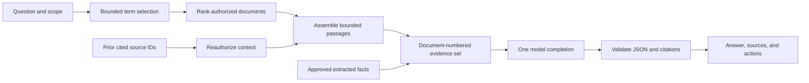

Archive research is Suchi's read-only retrieval-augmented generation (RAG)
surface. It retrieves evidence from documents the caller may read, sends only
that bounded evidence to the configured OpenAI-compatible model, validates the
model's citation contract, and keeps every source attached to the answer.

The answer surface is read-only. It cannot save a View, start extraction, or
open another screen on its own. Those actions happen only when the user follows
a link. Dates are the first extracted fact type; later extractors can use the
same storage and review path for other facts.

## User workflow

1. Enter a question in the global Omnibox and select **Ask**, or select documents
   on the Documents screen and choose **Ask selection**.
2. Suchi opens **Archive research** with the active scope shown in the header.
3. The server retrieves at most six authorized evidence sources.
4. The model returns one structured answer with source numbers.
5. Suchi rejects malformed or out-of-range citations before rendering anything.
6. The user can open a cited source or explicitly continue to Views, Approvals,
   or Calendar when the response exposes the corresponding action.

Follow-up questions carry up to three cited source IDs from the preceding
successful turn. The server reauthorizes and reloads those sources; prior
assistant text never becomes evidence.

## Retrieval architecture



### Candidate retrieval

Archive research uses a bounded high-recall lexical candidate pass rather than
interpreting the natural-language question as a rich query. Term selection,
prefix-OR behavior, BM25 weights, context-source retrieval, and the distinction
from ranked Search are centralized in
[Search architecture: Archive research retrieval](/search#archive-research-retrieval).

### Evidence bounds

- At most six documents per answer.
- At most three reauthorized context documents from the prior turn.
- Provider titles are clamped to 300 Unicode characters. Source text follows
  the administrator's **Research context** preset described below.
- Extracted facts are limited to three per source and twelve total; the response
  summary still counts every visible fact by status. Their existing 1,600
  Unicode-character value and evidence bounds do not grow with Research context.
- Context IDs are loaded directly in requested order without a prior-term test.
- Model generation is capped at 4,096 tokens, including provider reasoning where
  applicable; the visible answer remains capped at 6,000 characters.
- One provider call per successful turn.

No provider call occurs when retrieval finds no evidence.

### Research context presets

An administrator chooses one global preset under **Settings → Archive
configuration → Classification**. A missing or invalid stored value resolves to
**Balanced**. Saving the preset affects the next question immediately; it does
not reload or enable the model, change credentials, apply dates, clear an open
research drawer, or require a server restart.

| Preset | Matching passages per document | Source-text limit per document | Maximum across six sources |
| --- | ---: | ---: | ---: |
| Focused | 1 | 1,600 Unicode characters | 9,600 characters |
| Balanced (default) | 2 | 3,200 Unicode characters | 19,200 characters |
| Detailed | 3 | 4,800 Unicode characters | 28,800 characters |

The passage column counts matching FTS windows, not the optional distinct
document ending. That ending and Suchi's passage separators still count toward
the source-text ceiling. Titles, the question, bounded history, and
capability-gated accepted facts are separate parts of the provider request. The
six-source maximum does not change.

For a long matching document, Suchi keeps the first passage from the complete
normalized question. Balanced and Detailed can add distinct term-specific
passages in question-term order. Each FTS5 passage uses SQLite's maximum
64-token snippet window. Suchi temporarily marks the first match, clips around
it, removes every marker, and retains at most 1,200 Unicode characters. This
keeps the match even when unusually long tokens push it beyond the first 1,200
characters of SQLite's snippet. Whitespace-equivalent, duplicate, and contained
passages are removed. When space remains, a distinct document ending is
appended so receipt totals, signatures, and closing clauses are less likely to
disappear.

A document whose complete extracted text fits the selected per-document limit
is sent whole. One restricted FTS query checks every cited follow-up source for
the complete current question, so a matching passage cannot be displaced by
six better-ranked documents and Focused mode still receives it. A long cited
source with no current match uses a bounded beginning-and-ending fallback. The
stitched `snippet` returned to the browser is byte-for-byte the source text
supplied to the model, so the reader and provider see the same evidence under
each source number.

Authorization, scope resolution, document content, FTS passages, and fallbacks
are read through one read-only SQLite WAL snapshot per question. A concurrent
ACL, sensitivity, trash, or content change therefore appears either before
that retrieval or on the next one, never halfway through one evidence set.

Focused is the safest starting point for small local models or tight context
windows. Balanced is recommended for most local and hosted models. Detailed is
best reserved for models with enough context capacity when important evidence
is likely to be repeated or far apart in long documents. It can increase
latency, hosted token cost, and the amount of authorized document text sent to
the configured provider.

Detailed improves coverage; it is not exhaustive analysis of every repeated
occurrence in a very large document. Check totals and other high-consequence
claims against the cited sources.

## Scope

The research drawer supports these server-enforced scopes:

- all accessible archive documents;
- the current [rich-query](/query-language) result;
- the current Johnny.Decimal category;
- the exact visible sensitivity, type, tags, correspondents, created-time
  bounds, and language filters published by Documents or Search;
- the current document; or
- up to 100 explicitly selected documents.

Scope fields are additive and reuse the Documents SQL scope builder. Scope
narrows retrieval; it never grants access. Every query still applies the
caller's document visibility predicate, trash exclusion, and sensitivity rule.

## Grounding and citation contract

Suchi requests OpenAI-compatible JSON-object response mode. The provider must
then return this schema:

```json
{
  "answer": "The policy expires on September 14, 2026.",
  "citations": [1],
  "sufficient": true
}
```

Provider requirements are listed under
[LLM classifier: Hosted providers](/llm-classifier#hosted-providers).

Validation requires a non-empty bounded answer and every citation number to be
between `1` and the number of supplied sources. The `citations` array is the
structured grounding contract; Suchi adds any missing inline `[n]` markers
after validation. Existing inline markers remain accepted for provider
compatibility, and can supply the citation list when the array is empty.
Contradictory or out-of-range source numbers are rejected.

These checks verify the response format and source numbers. They do not prove
that every claim follows from the cited text. The reader can open each source to
check the answer.

When `sufficient` is false, or a nominally sufficient answer supplies no source
numbers at all, Suchi returns a stable insufficient-evidence answer and retains
the retrieved source boundary. Malformed responses and invalid source numbers
return `502 invalid_provider_response`.

A provider response with `finish_reason: "length"` returns
`502 provider_response_truncated`, even if its partial text happens to be valid
JSON. Suchi never displays that partial answer or retries automatically. Try a
narrower question or another model if the provider repeatedly reaches its output
limit. Other provider failures return `502 provider_failure`.

Document text remains untrusted prompt data. The system instruction tells the
model to ignore role changes and instructions inside evidence. Archive research
has no tools and no write operations, limiting prompt-injection impact to the
proposed answer.

## Conversation state

Conversation state exists only in the mounted browser application.

- Closing the drawer preserves it.
- **Clear** deletes it and resets sensitive-document consent.
- Changing the active scope or configured provider resets both transcript and
  sensitive consent. Disabling sensitive consent clears accumulated history.
- Only complete successful user/assistant pairs enter history.
- Failed and canceled turns cannot poison later role alternation.
- The drawer retains the newest 20 turns, bounding long-session DOM and evidence
  memory without changing the smaller provider-history limit.
- Only the newest complete pairs fitting four messages and 12 KB are sent.
- Follow-ups carry only sources actually cited by the preceding successful
  answer; an uncited retrieval set is never used as implicit context.
- The server stores no conversation rows.

## Save retrieved documents as a View

**Save retrieved documents as a view** creates a snapshot with `document_ids`
rather than trying to reconstruct the result from question words. The View
contains the documents shown under Evidence.

Opening or sharing the View re-runs document authorization. A shared snapshot
therefore exposes only the listed documents each viewer can already read.
Snapshot Views contain at most 100 IDs; archive research currently contributes
at most six.

Live Views use the explicit [query language](/query-language); approved
extracted dates participate in its `date:` and `date-role:` filters. Archive
research never synthesizes that live query from question words.

## Extracted facts and dates

`document_intelligence` is the shared review ledger for extracted facts. Its
stable columns cover every registered fact type:

- source document;
- `intelligence_type` and semantic `role`;
- validated `value_json` plus an indexed `sort_value`;
- original text, evidence quote, and optional source offset;
- confidence;
- `pending`, `accepted`, or `rejected` state;
- extractor, source blob, and extraction version; and
- reviewer and review timestamp.

Type-specific validation lives in `core/intelligence`. Adding a type requires a
small explicit value contract there, an extractor projection, and a UI renderer.
It does not require a new approval table or state model.

### Date extraction, review, and Calendar

Dates use this ledger without adding a second model completion. For the roles,
validation rules, confidence threshold, automatic and reviewed dates, rescans,
Approvals, and Calendar, see
[Document dates](/document-dates).

Dates available to Calendar may be included beside their original source
snippet in a later archive answer. The original document remains the evidence
and is still cited.

## Authorization

Archive research requires:

- authentication;
- `documents:read`; and
- the `archive_chat` capability, implicit for administrators.

Reviewing extracted facts, running extraction, and using Calendar require
`archive_intelligence`, also implicit for administrators. Calendar dates are
readable document metadata, so `documents:read` is sufficient for `date:` and
`date-role:` predicates. Extraction and review mutations additionally require
`documents:write` and Change permission on every source document.

Public demo sessions are denied both capabilities.

Retrieval, source snapshots, extracted fact lists, facts used in chat, and
calendar queries all apply document ACLs inside SQL. Confidential and
Restricted snippets are excluded from chat until the user enables the
per-conversation option. With consent off, only unset, Public, and Internal
sensitivities are eligible; unknown values fail closed.

## Provider privacy

The model transport is the same one used by classification:

- disabled when no endpoint is configured;
- non-local endpoints require explicit egress acknowledgement;
- redirects are refused;
- API keys never return to the browser;
- response bodies are bounded; and
- provider errors are sanitized.

The drawer identifies the local model or hosted endpoint receiving evidence.
For each turn the provider receives the question, the allowed complete history
pairs, and each selected source's title, sensitivity, snippet, and—when the user
has `archive_intelligence`—accepted fact value and evidence. It receives no ACL
rows or unrelated document metadata.
The archive-evidence assembly event records only the chosen context mode,
passage count, source count, and bounded evidence size. Failures add a fixed
reason such as `output_limit`, `invalid_answer_json`, or `citation_out_of_range`;
provider bodies and decoder error text are never logged. Separate operational
events still record the normal HTTP method, path, status, byte count, duration,
and request ID; calls to a hosted model also record its host and model name.
Sanitized failures may be logged. None of these events includes questions,
answers, titles, snippets, or extracted evidence.

## Abuse controls

Interactive research has three in-process controls:

- six evidence-bearing requests per minute per authenticated user, burst two;
- at most two concurrent multi-pass evidence retrievals per Suchi process; and
- at most two concurrent chat completions per Suchi process.

A rate token is reserved before retrieval, preventing rate-limited requests
from running the passage queries, and is returned when retrieval cannot start,
errors, or finds no provider-eligible evidence. Retrieval owns one reader
connection and does not occupy a provider-call slot. A refusal returns
`429 chat_rate_limited` and `Retry-After`. Reverse proxies may apply an
additional distributed limit.

## HTTP API

### Status

```http
GET /api/chat/status
```

```json
{
  "enabled": true,
  "provider": "localhost",
  "local": true
}
```

### Ask

```http
POST /api/chat
Content-Type: application/json
```

```json
{
  "question": "When does it renew?",
  "history": [
    { "role": "user", "content": "Which office lease applies?" },
    { "role": "assistant", "content": "The Indiranagar office lease [1]." }
  ],
  "context_source_ids": [17],
  "scope": {
    "query": "tag:lease",
    "document_ids": [],
    "jd_category_id": 0,
    "sensitivity": "internal",
    "document_type_id": 4,
    "tag_ids": [8],
    "correspondent_ids": [12],
    "created_at_gte": 1788134400,
    "created_at_lte": 1790726399,
    "language": "en"
  },
  "include_sensitive": false
}
```

`context_source_ids` accepts at most three cited IDs. The response includes
`answer`, `sources`, `citations`, `grounded`, and an
`intelligence` summary. Facts available to answers appear under their source's
`intelligence` field.

### Extracted facts

```http
GET  /api/intelligence/schema
GET  /api/intelligence/?status=pending&type=date
POST /api/intelligence/extract
POST /api/intelligence/resolve
```

Extraction request:

```json
{
  "document_ids": [17, 28],
  "types": ["date"]
}
```

Resolution request:

```json
{
  "candidate_ids": [71, 72],
  "decision": "accepted"
}
```

List filters include `status`, `type`, `role`, `sort_from`, `sort_to`,
`document_ids`, `view_id`, `q`, and normal pagination. `q` uses the same rich
query compiler as Search and Documents. `view_id` is resolved server-side and
applies the complete owned/shared View filter plus document ACLs.

## Maintainer file map

| Concern | Location |
| --- | --- |
| Chat request, retrieval, grounding | `core/api/chat.go` |
| Chat rate and concurrency gate | `core/api/chat_gate.go` |
| Generic intelligence API | `core/api/intelligence.go` |
| Intelligence value contracts | `core/intelligence/intelligence.go` |
| Intelligence schema | `core/db/migrations/0002_document_intelligence.sql` |
| Single-call model contract | `plugins/llm-classifier/llm.go` |
| Candidate persistence | `plugins/llm-classifier/handler.go` |
| Rich query date predicates | `core/searchquery/` |
| Research drawer | `ui/src/lib/ArchiveChat.svelte` |
| Review workspace | `ui/src/routes/Tasks.svelte` |
| Calendar | `ui/src/routes/Calendar.svelte` |

## Operational checks

Use a real configured model when changing either prompt contract:

1. Turn automatic Calendar dates off, then classify a long document with a date
   near the middle.
2. Confirm the candidate remains pending and includes matching evidence.
3. Approve it and confirm it appears on Calendar.
4. Ask a question whose answer uses the Calendar date.
5. Confirm the response JSON has valid citations and the source opens.
6. Ask a pronoun-based follow-up and confirm the prior cited source remains in
   the evidence set.

Unit tests pin value validation, date-signal conservatism, ACL behavior,
citation validation, request limits, exact Views, rich-query parity, approval,
and Calendar rendering.

## Current limits

- Retrieval is lexical FTS5, not semantic embedding search.
- Chat is intentionally transient and read-only.
- The classification call proposes at most three dates per document.
- Relative dates that cannot be normalized from explicit evidence are ignored.
- Extracted dates represent all-day archival facts; timed events and timezones
  are outside the current contract.
- Fact rules are never learned implicitly from one approval.
