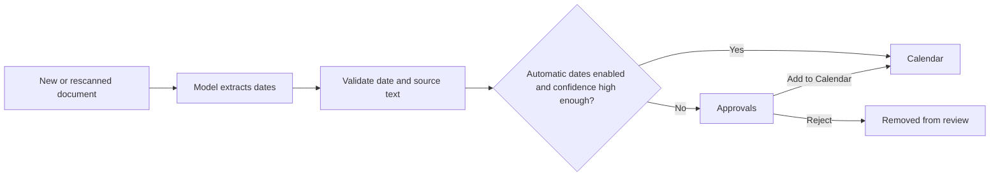

Suchi can find important dates in document text and place them on Calendar. Each
date keeps its source document and the exact text that produced it, so you can
verify the result instead of trusting an unexplained event.

This workflow is designed to stay out of the way:

- confident dates can go directly to Calendar;
- uncertain dates wait in Approvals; and
- you can require review for every date.

## How it works



For each document, the existing classification request may propose up to three
important dates. Suchi validates the date, its role, and the supporting text
before storing it. This does not add a second model request.

The model chooses a role from the document's context. These are the eight
allowed roles and their intended meanings, not hard-coded classification rules:

| Role | Intended meaning |
| --- | --- |
| `issued` | When a document was issued |
| `due` | A payment or action deadline |
| `start` | When an agreement, coverage, or activity begins |
| `end` | When a period or activity ends |
| `expiry` | When something stops being valid |
| `renewal` | When an agreement or subscription renews |
| `service` | When a service was provided |
| `other` | Another relevant date that does not fit those roles |

Suchi checks date format, allowed roles, and supporting text. Those checks do
not independently verify the model's interpretation of a role. Read the source
quote; turn automatic dates off if each new date should need a human decision
in Approvals before reaching Calendar.

## Date precision and confidence

Precision describes how much of the date the document supplies. There are
exactly three values:

| Precision | Meaning | Example display |
| --- | --- | --- |
| `day` | A specific day | 6 Aug 2026 |
| `month` | A month, without a known day | Aug 2026 |
| `year` | A year, without a known month or day | 2026 |

Calendar and Approvals display only the known precision. For storage and
sorting, August 2026 uses `2026-08-01` and the year 2026 uses `2026-01-01`.
Those first-day placeholders do not mean the document names that exact day.

Confidence is separate: it is the model's self-reported score for its extraction,
not a measured probability of correctness. A model can be highly confident that
the document names only a year. Percentages are rounded; even **100%** is not a
guarantee. Check the source text before relying on a date.

## Choose automatic or reviewed dates

Open **Settings → Archive configuration → Classification**.

Keep **Learn from similar documents in this archive** on if you want local
archive matching. It does not require a model.

Configure the optional model and choose **Test connection**. The **Choose what
Suchi can handle automatically** section keeps the controls in two boxes:

- **Works without a model** contains archive matching and its own save action.
- **Uses the configured model** contains **Apply model suggestions at** and
  **Add high-confidence dates to Calendar automatically**.

The model suggestion score is the automatic-date threshold. When automatic
dates are on, dates at or above it go directly to Calendar; everything else
goes through Approvals. Turn automatic dates off to send every extracted date
through Approvals.

Enabling automatic dates or lowering the score also moves matching pending
dates to Calendar without another model call. Turning it off or raising the
score never removes dates already in Calendar.

<Info>
  Automatic dates are enabled by default. Confidence reduces review work; it is
  not proof that a date is correct. Every Calendar entry still links to its
  document and supporting text.
</Info>

## Automatic and reviewed dates

Calendar distinguishes how each date got there:

- An **automatic** date was extracted while automatic dates were enabled and
  met the configured threshold. It keeps its confidence, extractor, extraction
  version, source revision, and evidence, but has no reviewer.
- A **reviewed** date records the person's decision and review time. Rejected
  dates do not appear on Calendar.

Calendar's agenda shows the date role and **Automatic** or **Reviewed** status.
Expand that status to see **LLM Classifier confidence: N%**. The date itself
conveys its precision, without a separate `day`, `month`, or `year` label.

Rescanning refreshes unreviewed machine output from the current document and
extractor version. It does not overwrite a person's accepted or rejected
decision. This prevents stale automatic results from accumulating while keeping
human decisions durable.

## Review dates in Approvals

Approvals shows only dates that still need a decision. Dates are grouped by
source document. When there are more than two document groups, desktop uses a
two-column grid; mobile remains a single column.

Some pending dates are preselected to reduce repetitive clicking. Before acting:

1. Read the parsed date, role, confidence, and document text.
2. Uncheck anything incorrect.
3. Choose **Add N to Calendar** for the selected dates, or **Reject N** to remove
   the selected dates from review.

The selected-date action bar remains visible while you scroll. Unselected dates
stay in Approvals for a later decision.

See [Approvals](/approvals) for permissions and API behavior.

## Find dates on Calendar

Calendar shows dates added automatically and dates approved in Approvals. It
supports:

- a month grid, a full-width day agenda, or an all-dates agenda for
  document-scoped links;
- date-role filtering;
- all accessible documents or one saved View; and
- direct links back to each source document.

Calendar always reapplies document access rules. A date cannot reveal a document
the viewer is not allowed to read.

Only exact-day dates appear in day cells. Month-only and year-only dates stay in
the agenda. Month filtering still uses the stored sorting date: a month-only
date appears in that month's agenda, and a year-only date in January's agenda.
It does not repeat a year-only date in every month. Research links below avoid
this month filter and include all months and years.

### Open a day's dates

Select a day number in the month grid to open its full-width agenda. This lists
every exact-day date for that day, keeping the selected **Document view** and
**Date role**. Month/year placeholders never appear as dates on the first day.
More than 500 matching facts use **Previous** and **Next** pages.

**Back to Month YYYY** returns to the month you came from with those filters
intact. Calendar keeps its month, selected day, View, and role in the URL, so
reload and browser Back/Forward retain that context. A day agenda can be linked
directly, for example `#/calendar?month=2026-08&date=2026-08-06&role=due`.

### Dates linked from archive research

**Open N calendar dates** in Archive research opens an agenda for all retrieved
documents in that answer, across every month and year. The banner reads
**Dates from N selected documents · All months and years**. Entries appear in
chronological order with the full year, source document, and supporting text.
The document count in the banner is separate from the number of dates.

**Date role** still filters the agenda. The month controls and **Document view**
selector are hidden because the link already supplies the document scope.
Opening a different document-scoped link clears the previous saved View, date
role, and page. More than 500 matching dates use **Previous** and **Next** pages;
they are not limited to the current month.

**Open full calendar** removes the document scope and returns to the unfiltered
current-month grid.

### Add a reviewed date to another calendar

In an agenda entry, expand **Add to calendar**, read the export notice, and
choose **Download .ics**. Open or import the file in a calendar application.
This is available for reviewed, accepted dates with an exact day, for any date
role. Automatic dates do not offer export. Neither do month/year-only dates,
whose sorting placeholders are not known calendar days.

The downloaded file contains one all-day event with the document title, date
role, and a link to the source document. It contains no document attachment or
source quote. The link still requires the recipient's normal Suchi access; an
export does not create a public share link.

Suchi generates the file locally in the browser, without connecting a calendar
account. Importing it into a synced calendar may send its contents to that
calendar's provider. The file is a snapshot, not a subscription: later changes
in Suchi do not update an imported event. Repeated exports from the same archive
URL retain the event's identifier, but duplicate-import behavior depends on the
calendar application. No reminder, recurrence, or time zone is inferred, and
the event does not mark the day as busy.

### Search by date

You can also use dates in the [query language](/query-language):

```text
date:2026-08-06
date:>=2026-08-01 date:<2026-09-01
date-role:renewal
is:dated
```

Pending and rejected dates never match these filters.

## Apply the current settings to older documents

The confidence and automatic-date settings apply to new documents immediately.
They also govern new machine output from documents you explicitly rescan.

To process older documents:

1. Open **Documents**.
2. Select the documents.
3. Choose **Rescan** or **Extract dates**.

Enabling automatic dates or lowering the confidence score promotes matching
pending dates immediately. A rescan is only necessary when the document still
needs extraction run again. During that rescan Suchi replaces stale automatic
and pending output, while preserving dates a person already accepted or
rejected.

See [Pipeline versions and rescans](/pipeline-versions) for the difference
between unprocessed, stale, and completed documents.

## Why a date might be missing

Check these in order:

1. **Approvals:** the date may be waiting for a decision.
2. **Calendar filters:** check the date role and document scope. On the full
   calendar, also check the month and Document view.
3. **Document text:** open the document and confirm extraction captured the date.
4. **Model settings:** confirm the model is active and automatic dates are set as
   intended.
5. **Processing:** select the document and run **Rescan** or **Extract dates**.
6. **Access:** confirm you can read the source document and have **Manage document
   dates** permission.

If no valid date appears after a successful rescan, inspect the processing job
under Approvals and the model configuration under
[LLM classifier](/llm-classifier).

## Current limits

- Dates are all-day document facts, not timed meetings.
- Time zones and reminders are not inferred.
- Relative phrases that cannot be normalized from explicit document text are
  ignored.
- Bare account numbers, totals, and version numbers are not treated as dates.
- At most three dates are proposed per classification run.
- Existing Calendar dates are never silently removed by a setting change.

For the storage fields and HTTP contracts, see [Archive research](/archive-chat)
and [API reference](/api#extracted-facts-archive_intelligence).
