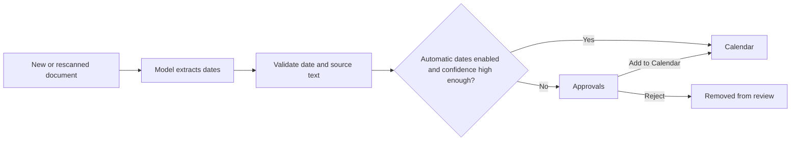

Suchi can find important dates in document text and place them on Calendar. Each
date keeps its source document and the exact text that produced it, so you can
verify the result instead of trusting an unexplained event.

This workflow is designed to stay out of the way:

- confident dates can go directly to Calendar;
- uncertain dates wait in Approvals; and
- you can require review for every date.

## How it works



For each document, the existing classification request may propose up to three
important dates. Suchi validates the date, its role, and the supporting text
before storing it. This does not add a second model request.

Dates can have these roles:

```text
issued, due, start, end, expiry, renewal, service, other
```

Examples include an invoice due date, policy expiry, flight date, lease renewal,
or the issue date printed on a form.

## Choose automatic or reviewed dates

Open **Settings → Archive configuration → Classification**.

Keep **Learn from similar documents in this archive** on if you want local
archive matching. It does not require a model.

Configure the optional model and choose **Test connection**. The **Choose what
Suchi can handle automatically** section keeps the controls in two boxes:

- **Works without a model** contains archive matching and its own save action.
- **Uses the configured model** contains **Apply model suggestions at** and
  **Add high-confidence dates to Calendar automatically**.

The model suggestion score is the automatic-date threshold. When automatic
dates are on, dates at or above it go directly to Calendar; everything else
goes through Approvals. Turn automatic dates off to send every extracted date
through Approvals.

Enabling automatic dates or lowering the score also moves matching pending
dates to Calendar without another model call. Turning it off or raising the
score never removes dates already in Calendar.

<Info>
  Automatic dates are enabled by default. Confidence reduces review work; it is
  not proof that a date is correct. Every Calendar entry still links to its
  document and supporting text.
</Info>

## Automatic and reviewed dates

Calendar distinguishes how each date got there:

- An **automatic** date was extracted while automatic dates were enabled and
  met the configured threshold. It keeps its confidence, extractor, extraction
  version, source revision, and evidence, but has no reviewer.
- A **reviewed** date records the person's decision and review time. Rejected
  dates do not appear on Calendar.

Rescanning refreshes unreviewed machine output from the current document and
extractor version. It does not overwrite a person's accepted or rejected
decision. This prevents stale automatic results from accumulating while keeping
human decisions durable.

## Review dates in Approvals

Approvals shows only dates that still need a decision. Dates are grouped by
source document. When there are more than two document groups, desktop uses a
two-column grid; mobile remains a single column.

Some pending dates are preselected to reduce repetitive clicking. Before acting:

1. Read the parsed date, role, confidence, and document text.
2. Uncheck anything incorrect.
3. Choose **Add N to Calendar** for the selected dates, or **Reject N** to remove
   the selected dates from review.

The selected-date action bar remains visible while you scroll. Unselected dates
stay in Approvals for a later decision.

See [Approvals](/approvals) for permissions and API behavior.

## Find dates on Calendar

Calendar shows dates added automatically and dates approved in Approvals. It
supports:

- month and agenda views;
- date-role filtering;
- all accessible documents or one saved View; and
- direct links back to each source document.

Calendar always reapplies document access rules. A date cannot reveal a document
the viewer is not allowed to read.

You can also use dates in the [query language](/query-language):

```text
date:2026-08-06
date:>=2026-08-01 date:<2026-09-01
date-role:renewal
is:dated
```

Pending and rejected dates never match these filters.

## Apply the current settings to older documents

The confidence and automatic-date settings apply to new documents immediately.
They also govern new machine output from documents you explicitly rescan.

To process older documents:

1. Open **Documents**.
2. Select the documents.
3. Choose **Rescan** or **Extract dates**.

Enabling automatic dates or lowering the confidence score promotes matching
pending dates immediately. A rescan is only necessary when the document still
needs extraction run again. During that rescan Suchi replaces stale automatic
and pending output, while preserving dates a person already accepted or
rejected.

See [Pipeline versions and rescans](/pipeline-versions) for the difference
between unprocessed, stale, and completed documents.

## Why a date might be missing

Check these in order:

1. **Approvals:** the date may be waiting for a decision.
2. **Calendar filters:** reset the month, date role, and Document view.
3. **Document text:** open the document and confirm extraction captured the date.
4. **Model settings:** confirm the model is active and automatic dates are set as
   intended.
5. **Processing:** select the document and run **Rescan** or **Extract dates**.
6. **Access:** confirm you can read the source document and have **Manage document
   dates** permission.

If no valid date appears after a successful rescan, inspect the processing job
under Approvals and the model configuration under
[LLM classifier](/llm-classifier).

## Current limits

- Dates are all-day document facts, not timed meetings.
- Time zones and reminders are not inferred.
- Relative phrases that cannot be normalized from explicit document text are
  ignored.
- Bare account numbers, totals, and version numbers are not treated as dates.
- At most three dates are proposed per classification run.
- Existing Calendar dates are never silently removed by a setting change.

For the storage fields and HTTP contracts, see [Archive research](/archive-chat)
and [API reference](/api#extracted-facts-archive_intelligence).
