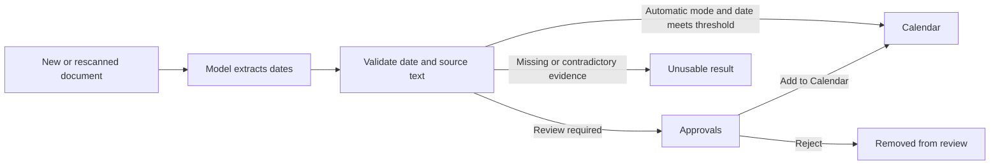

Suchi can find important dates in document text and place them on Calendar. Each
date keeps its source document and the exact text that produced it, so you can
verify the result instead of trusting an unexplained event.

High-confidence new dates reach Calendar automatically by default. Turn off
**Automatically apply high-confidence suggestions** to review inferred changes
in Approvals first. Existing accepted and rejected dates retain
their recorded history.

Calendar, review queues, counts, date queries and local ICS export use the captured
filing system and visible source documents. Membership and document ACLs remain
required; an approval assignment does not grant entry. Switching systems clears
the former Calendar/review context. Date/model policy settings remain instance-wide.

## How it works



For each document, the existing classification request may propose up to three
important dates. Suchi validates the date, its role, and the supporting text
before storing it. This does not add a second model request.

The model chooses a role from the document's context. These are the eight
allowed roles and their intended meanings, not hard-coded classification rules:

| Role      | Intended meaning                                    |
| --------- | --------------------------------------------------- |
| `issued`  | When a document was issued                          |
| `due`     | A payment or action deadline                        |
| `start`   | When an agreement, coverage, or activity begins     |
| `end`     | When a period or activity ends                      |
| `expiry`  | When something stops being valid                    |
| `renewal` | When an agreement or subscription renews            |
| `service` | When a service was provided                         |
| `other`   | Another relevant date that does not fit those roles |

Suchi checks date format, allowed roles, an exact source quote and a matching
date spelling in the original extracted text. These checks do not independently
verify the model's interpretation of a role. Read the quote and open the source
before relying on a date; even a score of 100% is not a guarantee.

## Date precision and confidence

Precision describes how much of the date the document supplies. There are
exactly three values:

| Precision | Meaning                              | Example display |
| --------- | ------------------------------------ | --------------- |
| `day`     | A specific day                       | 6 Aug 2026      |
| `month`   | A month, without a known day         | Aug 2026        |
| `year`    | A year, without a known month or day | 2026            |

Calendar and Approvals display only the known precision. For storage and
sorting, August 2026 uses `2026-08-01` and the year 2026 uses `2026-01-01`.
Those first-day placeholders do not mean the document names that exact day.

Confidence is separate: it is the model's self-reported score for its extraction,
not a measured probability of correctness. A model can be highly confident that
the document names only a year. Percentages are rounded; even **100%** is not a
guarantee. Check the source text before relying on a date.

## Configure application mode

Open **Settings → Archive configuration → Classification**.

**Automatically apply high-confidence suggestions** is checked by default:

- **On:** Add dates to Calendar and apply suggested metadata when they meet your thresholds.
- **Off:** Review inferred changes in Approvals before they apply.

Use **Save application mode** to save this choice independently of matching,
model activation, credentials and research settings. It covers new inferred
dates, model metadata and local archive matching, not explicit user-authored rules.

The model/date threshold defaults to `0.70`. Each date uses its own score,
independently of the document's overall classification score. Local matching
needs no model: its automatic threshold defaults to `0.90`, with a `0.50`
minimum review-suggestion score. Below-threshold usable dates still need review.

Configure the optional model and choose **Test connection**. The test uses
synthetic text; it checks connectivity and response format, not accuracy, and
does not enable the model. **Enable model and save options** activates the tested
configuration. Application mode does not authorize external text sharing.

Saving settings, lowering a threshold or restarting Suchi never promotes existing
pending dates. The current mode applies to new ingests and explicit rescans.

## Automatic and reviewed dates

Calendar distinguishes how each date got there:

- An **automatic** date was accepted under the current threshold policy, without
  a human reviewer or review time. Source and exact evidence checks still apply.
- A **previously accepted** date has no recorded review. This includes dates
  accepted automatically by older versions. Its value, evidence and original
  attribution are preserved; Suchi does not invent a reviewer.
- A **reviewed** date records the person's decision and review time. Rejected
  dates do not appear on Calendar.

Calendar's agenda shows the date role and **Automatic**, **Previously accepted**
or **Reviewed** status. Expand it to see the model-reported confidence. Automatic
means an accepted, unreviewed date with policy version `threshold-auto-v1`, not
simply any date without a reviewer. The date itself conveys its precision,
without a separate `day`, `month`, or `year` label.

Rescanning replaces pending machine output, not accepted or rejected facts.
New candidate IDs are never reused. Old pending candidates without a provable
source generation cannot be accepted; request fresh extraction instead.
An older immutable document version retains its own review history: a new
version does not retarget an earlier fact or copy its authority.

## Review dates in Approvals

Approvals shows only dates that still need a decision. Dates are grouped by
source document. When there are more than two document groups, desktop uses a
two-column grid; mobile remains a single column.

Before acting:

1. Read the proposed date, role, reason and exact source quote. Producer and
   score details expand on demand.
2. Select the dates you have checked.
3. Choose **Add N to Calendar**, or **Reject N** to dismiss selected suggestions.

The action bar remains visible while you scroll. Unselected dates stay pending.
Stale or unsupported candidates cannot be accepted; supported stale suggestions
can still be rejected. Sensitive evidence requires Reveal. Refresh after source
or access changes; a queued extraction is not an accepted date.

See [Approvals](/approvals) for permissions and API behavior.

## Find dates on Calendar

The public demo has read-only, curated source dates labeled **Demo example**.
They are not live model results and do not show classifier confidence. Its
default Calendar lists all example dates across months and years. Model calls,
date extraction, and date review remain unavailable to demo visitors.

Calendar shows reviewed dates alongside previously accepted dates. It
supports:

- a month grid, a full-width day agenda, or an all-dates agenda for
  document-scoped links;
- date-role filtering;
- all accessible documents or one saved View; and
- direct links back to each source document.

Calendar always reapplies document access rules. A date cannot reveal a document
the viewer is not allowed to read.

Only exact-day dates appear in day cells. Month-only and year-only dates stay in
the agenda. Month filtering still uses the stored sorting date: a month-only
date appears in that month's agenda, and a year-only date in January's agenda.
It does not repeat a year-only date in every month. Research links below avoid
this month filter and include all months and years.

### Open a day's dates

Select a day number in the month grid to open its full-width agenda. This lists
every exact-day date for that day, keeping the selected **Document view** and
**Date role**. Month/year placeholders never appear as dates on the first day.
More than 500 matching facts use **Previous** and **Next** pages.

**Back to Month YYYY** returns to the month you came from with those filters
intact. Calendar keeps its month, selected day, View, and role in the URL, so
reload and browser Back/Forward retain that context. A day agenda can be linked
directly, for example `#/calendar?month=2026-08&date=2026-08-06&role=due`.

### Dates linked from archive research

**Open N calendar dates** in Archive research opens an agenda for all retrieved
documents in that answer, across every month and year. The banner reads
**Dates from N selected documents · All months and years**. Entries appear in
chronological order with the full year, source document, and supporting text.
The document count in the banner is separate from the number of dates.

**Date role** still filters the agenda. The month controls and **Document view**
selector are hidden because the link already supplies the document scope.
Opening a different document-scoped link clears the previous saved View, date
role, and page. More than 500 matching dates use **Previous** and **Next** pages;
they are not limited to the current month.

**Open full calendar** removes the document scope and returns to the unfiltered
current-month grid.

### Add a reviewed date to another calendar

In an agenda entry, expand **Add to calendar**, read the export notice, and
choose **Download .ics**. Open or import the file in a calendar application.
This is available for reviewed, accepted dates with an exact day, for any date
role. Automatic dates do not offer export. Neither do month/year-only dates,
whose sorting placeholders are not known calendar days.

The downloaded file contains one all-day event with the document title, date
role, and a link to the source document. It contains no document attachment or
source quote. The link still requires the recipient's normal Suchi access; an
export does not create a public share link.

Suchi generates the file locally in the browser, without connecting a calendar
account. Importing it into a synced calendar may send its contents to that
calendar's provider. The file is a snapshot, not a subscription: later changes
in Suchi do not update an imported event. Repeated exports from the same archive
URL retain the event's identifier, but duplicate-import behavior depends on the
calendar application. No reminder, recurrence, or time zone is inferred, and
the event does not mark the day as busy.

### Search by date

You can also use dates in the [query language](/query-language):

```text
date:2026-08-06
date:>=2026-08-01 date:<2026-09-01
date-role:renewal
is:dated
```

Pending and rejected dates never match these filters.

## Apply the current settings to older documents

Model settings affect new documents and explicitly requested extraction.
They never change the decision on a pending, accepted or rejected date.

To process older documents:

1. Open **Documents**.
2. Select the documents.
3. Choose **Rescan** or **Extract dates**.

New usable results follow the current mode and their own score. Rescanning
preserves accepted and rejected facts, including legacy automatic acceptance.
Automatic acceptance and review check current source generation and exact
evidence inside the database transaction; in-flight human decisions are not
overwritten. Review also checks current document access. Retrying the same
recorded decision does not apply it twice; an opposite decision on an already
resolved candidate is a conflict.

See [Pipeline versions and rescans](/pipeline-versions) for the difference
between unprocessed, stale, and completed documents.

## Why a date might be missing

Check these in order:

1. **Approvals:** the date may be waiting for a decision.
2. **Calendar filters:** check the date role and document scope. On the full
   calendar, also check the month and Document view.
3. **Document text:** open the document and confirm extraction captured the date.
4. **Model settings:** confirm the model is active and check application mode and threshold.
5. **Processing:** select the document and run **Rescan** or **Extract dates**.
6. **Access:** confirm you can read the source document and have **Manage document
   dates** permission.

If no valid date appears after a successful rescan, inspect the processing job
under Approvals and the model configuration under
[LLM classifier](/llm-classifier).

## Current limits

- Dates are all-day document facts, not timed meetings.
- Time zones and reminders are not inferred.
- Relative phrases that cannot be normalized from explicit document text are
  ignored.
- Bare account numbers, totals, and version numbers are not treated as dates.
- At most three dates are proposed per classification run.
- Existing Calendar dates are never silently removed by a setting change.

For the storage fields and HTTP contracts, see [Archive research](/archive-chat)
and [API reference](/api#extracted-facts-archive_intelligence).
