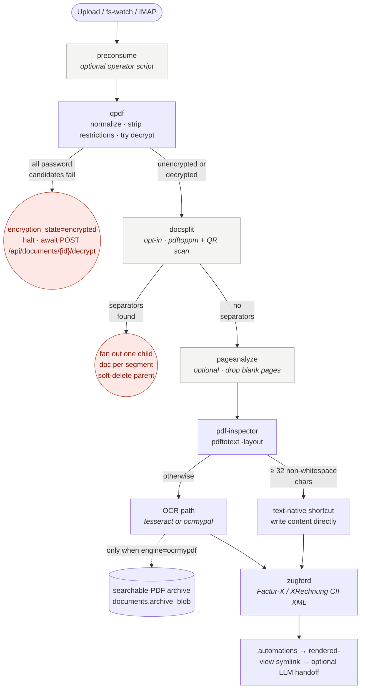

suchi's ingest pipeline branches by MIME type sniffed server-side from
the first 512 bytes of the upload. Every branch **degrades gracefully**:
if the binary a branch needs isn't installed, the doc is still stored
and searchable, `documents.content` just lands empty until the tool
shows up.

## Format matrix

| MIME                                          | What happens                                                                                                                                                             | Binary needed                                                       |            Standard image            |               Full image               |
| --------------------------------------------- | ------------------------------------------------------------------------------------------------------------------------------------------------------------------------ | ------------------------------------------------------------------- | :----------------------------------: | :------------------------------------: |
| `application/pdf`                             | qpdf normalize → pdf-inspector routes text-native vs OCR → ZUGFeRD invoice extraction                                                                                    | `qpdf`, `pdftotext`, tessocr (`pdftoppm`+`tesseract`) OR `ocrmypdf` | ✅ full PDF chain (no OCR'd archive) | ✅ full PDF chain (with OCR'd archive) |
| Common raster images (PNG, JPEG, GIF, TIFF, WebP, BMP) | ImageMagick wraps the image in a PDF; OCR text and QR / DataMatrix / Aztec barcode tokens land in `documents.content`                                              | ImageMagick plus the configured OCR engine                          |                  ✅                  |                   ✅                   |
| Other `image/*` formats                       | QR / DataMatrix / Aztec barcodes are decoded into `documents.content` as `barcode:<value>` tokens                                                                         | none (pure Go via gozxing)                                          |                  ✅                  |                   ✅                   |
| `application/epub+zip`, `application/epub`    | `anydoc` converts the EPUB spine to GitHub-flavored Markdown in `documents.content`                                                                                       | `anydoc`                                                            |                  ✅                  |                   ✅                   |
| Office, OpenDocument, RTF, and CSV             | `anydoc` converts the document to GitHub-flavored Markdown                                                                                                                | `anydoc`                                                            |                  ✅                  |                   ✅                   |
| Plain text, Markdown, and HTML                 | Original text is indexed directly, capped at 1 MiB                                                                                                                        | none                                                                |                  ✅                  |                   ✅                   |
| `image/vnd.djvu`, `image/x-djvu`              | `djvutxt` extracts the embedded OCR text layer                                                                                                                           | `djvutxt` (djvulibre-bin)                                           |                  ✅                  |                   ✅                   |
| `image/heic`, `image/heif` (`.heic`, `.heif`) | ImageMagick converts to a single-page PDF; OCR makes the text searchable in Suchi, and OCRmyPDF also embeds the text layer in the archive PDF                           | `magick` or `convert` (ImageMagick) with HEIF delegate              |                  ✅                  |                   ✅                   |
| `message/rfc822` (`.eml` files)               | Parse via net/mail; headers → title/date/correspondent, body text → content, each attachment becomes its own document linked via `email_parent_id`                       | none (pure Go)                                                      |                  ✅                  |                   ✅                   |
| `application/vnd.ms-outlook` (`.msg` files)   | `msgconvert` transforms the CFB binary into RFC 822; falls through to the `.eml` path so Message-Id dedup + attachment fanout + correspondent inheritance work unchanged | `msgconvert` (Email::Outlook::Message)                              |                  ✅                  |                   ✅                   |

Anything else lands as a doc with empty content — the original bytes
are safe in the CAS, dedup + metadata still work, but there's no text
index. Add a converter (or wait for a future ingester) to fill in
`documents.content` later.

## PDF pipeline in detail

Email attachments with missing, generic, or malformed MIME headers (such as
`bin`) are identified from their bytes. If an older PDF appears as a binary
file, select it in Documents and choose **Rescan** after upgrading. Post-ingest
corrects that MIME label before routing; password-protected PDFs then enter
the normal decryption flow below. Original bytes are unchanged.

The PDF path is the most involved because it fans out based on content:



Detail per step (matching the boxes above):

- **preconsume** — operator-defined script; see [preconsume](/preconsume).
- **qpdf** — normalize, strip restrictions, decrypt using empty password
  - candidates from the passwords file + learned passwords for this
    owner. If all attempts fail: mark `encryption_state='encrypted'` and
    halt — operator supplies a password via
    `POST /api/documents/{id}/decrypt` to resume.
- **docsplit** — opt-in QR-scan pass. When separators fire, fan out one
  child doc per segment, soft-delete the parent, and exit (children
  carry the chain).
- **pageanalyze** — optional. `pdftoppm` at 50 DPI → per-page mean
  intensity → `qpdf --pages …` to keep only non-blank pages in the
  working copy.
- **pdf-inspector** — `pdftotext -layout`. ≥ 32 non-whitespace chars is
  the text-native shortcut (write `documents.content` directly);
  otherwise fall through to OCR (see engine dispatch below).
- **OCR path** — writes the text sidecar to `documents.content`. When
  the engine is `ocrmypdf` it also writes a searchable-PDF archive
  into `documents.archive_blob`.
- **zugferd** — `qpdf --list-attachments` → `--show-attachment` → CII
  XML parse. Emits `invoice_*` custom fields when a Factur-X /
  XRechnung attachment is present.

Each step degrades independently. Missing `pdftotext` sends every PDF
to the OCR path (slower but correct). Missing OCR engine leaves the
content empty for scanned PDFs. Missing `qpdf` keeps the original
bytes as-is (encrypted PDFs will then fail downstream).

### OCR engine dispatch

Two engines are supported and picked at boot via `OCR_ENGINE`:

| `OCR_ENGINE`     | Engine                                                          | Binaries                             | Extras             |
| ---------------- | --------------------------------------------------------------- | ------------------------------------ | ------------------ |
| `auto` (default) | prefers **tesseract**, falls back to **ocrmypdf**               | pdftoppm + tesseract, OR ocrmypdf    | zero-config        |
| `tesseract`      | in-process pdftoppm → tesseract chain (`core/pipeline/tessocr`) | pdftoppm (poppler-utils) + tesseract | standard image default |
| `ocrmypdf`       | ocrmypdf CLI wrapper (`core/pipeline/ocrmypdf`)                 | ocrmypdf + tesseract                 | full image default |

`tesseract` is the smaller runtime path and does not produce a searchable-PDF archive —
`documents.archive_blob` stays NULL for scanned docs. FTS + full-text
search still work over `documents.content`. Pick `ocrmypdf` when you
want the archive PDF (e.g. long-term retention where the searchable
PDF matters more than image size), or set to `auto` and let the image
you deployed decide.

The lightweight engine retries a successfully processed page once with sparse
text segmentation (`--psm 11`) only when normal OCR found no text. This helps
isolated labels without replacing text already found. Rasterization, every page,
and any retry share one `SUCHI_TESSERACT_TIMEOUT` deadline; extracted text is
bounded by the configured output cap. It does not infer rotation from unreliable
orientation guesses or correct photographed perspective. Configure
`OCR_LANGUAGES` for the languages on the page; the default is English.

### Password-protected PDFs

Encrypted PDFs go through a candidate-passwords loop before being
parked as `pending-decryption`. The loop tries, in order:

1. **Empty password** — the "owner restrictions only" case (very common
   for bank statements, invoices). `qpdf --decrypt=` with no password.
2. **Passwords file** (optional) — `INGEST_PASSWORDS_FILE` points at
   a newline-separated list of candidates; blank lines and `#` comments
   are skipped. Chmod 600 recommended.
3. **Learned passwords** — every password an operator supplies via
   `POST /api/documents/{id}/decrypt` with `remember=true` gets sealed
   with AES-256-GCM (`.decrypt-key` file) and stored owner-scoped in
   the `decryption_passwords` table. Hot passwords hit first.

If every candidate fails, the doc lands in
`encryption_state='encrypted'` with the pipeline halted. Surface it via
`GET /api/documents/pending-decryption`. The operator supplies a
password:

```sh
curl -X POST http://127.0.0.1:8000/api/documents/42/decrypt \
     -H "Authorization: Token $TOKEN" \
     -H 'Content-Type: application/json' \
     -d '{"password":"hunter2","remember":true,"label":"BofA 2024"}'
```

On success suchi writes a decrypted CAS blob (originals are always
preserved verbatim in `original_blob`), flips the state, and re-enqueues
`post-ingest` — the doc flows through the rest of the pipeline (OCR,
ZUGFeRD, automations, render) as if it had arrived unencrypted.

**Batch decrypt** — for monthly statements where multiple accounts share
a password, `POST /api/documents/decrypt-batch` accepts a doc-id array
and one password; `remember=true` fires once per batch on first hit.

**qpdf warnings-are-fine gotcha.** Some bank PDFs ship spec-nonconformant
`/Perms` and produce qpdf exit code 3 (warnings). suchi treats exit 3
with non-empty output as success — the pragmatic convention for
pre-consume decrypt.

### Email (message/rfc822)

`.eml` files land as documents with the email body text as
`documents.content` and headers projected onto standard fields:

- `title` ← Subject (RFC 2047 encoded-word decoded)
- `created_at` ← Date header (unix epoch)
- `email_message_id` ← Message-Id (for future dedup on re-syncs)
- Sender (`From: Name <email>`) upserts into the `correspondents`
  table and attaches to the doc under `role=sender`.

For Outlook `.msg` files, `msgconvert` creates a temporary RFC 822
working copy for this same parsing path. The original CFB bytes remain
in `original_blob`, and downloads retain the
`application/vnd.ms-outlook` MIME type.

**Attachments fan out into sibling docs.** Each attachment gets its
own `documents` row with `email_parent_id` pointing back at the
`.eml`, its own CAS blob, and its own `post-ingest` job — so an
attached PDF flows through the entire pipeline (qpdf, OCR, ZUGFeRD,
automations, render) as if it had arrived directly. `multipart/related`
inline images (referenced from an HTML body) are NOT ingested as
separate docs — they're kept inside the parent .eml's CAS blob only.

Attachment children inherit the parent's correspondents (so the
`From:` sender shows up on every child PDF), owner, and JD category.
They do NOT inherit tags or document type — the pipeline (automations,
LLM classifier) reclassifies each child independently.

**How to feed it in.** Any of the three supported ingest paths works;
suchi doesn't care what put the `.eml` on the disk:

- **`INGEST_FS_DIR`** — a fs-watch on a Maildir or archive folder.
  Pair with [mbsync/isync](https://isync.sourceforge.io/) against your
  IMAP server (or a Bridge like Proton's) to keep the folder fresh.
  Recommended for setups that already have a mail sync toolchain.
- **Mailboxes UI** — direct IMAP polling. Suchi seals the account credential
  and pulls new messages on the configured interval.
- **Upload API** — POST a `.eml` file to `/api/documents/` for one-off
  imports.

The parser is pure Go stdlib (`net/mail` + `mime/multipart` +
`mime/quotedprintable`) — it works in both standard and full images with
no external tools. RFC 2047 encoded-word subjects, quoted-printable +
base64 bodies, and nested multipart trees all decode correctly.

### Multi-doc splitting on QR separator sheets

Feeder-scanning a stack of unrelated documents produces one large PDF
that should really be N docs. Opt in with `SCAN_SPLIT_ENABLED=on` and
suchi will detect **separator sheets** — pages carrying a QR code with
a specific payload — and fan out one document per segment.

**Setup:**

1. Generate a separator sheet:

   ```sh
   qrencode -s 20 -o separator.png SUCHI-SPLIT
   ```

   Print several copies. Any QR encoder works; the default token is
   `SUCHI-SPLIT` (override via `SCAN_SPLIT_TOKEN`).
2. Enable in the environment:

   ```sh
   export SCAN_SPLIT_ENABLED=on
   ```

3. Insert a separator between each document in your feeder stack and
   scan the whole pile as one PDF. Upload as usual.

**What happens on ingest:**

- `docsplit` rasterizes each page at 150 DPI and scans for QR codes.
- Separator pages are dropped; the ranges between them become segments.
- Each segment becomes a fresh document (with its own `original_blob`
  and `post-ingest` job), linked via `split_parent_id`.
- The parent doc is soft-deleted so the workspace only shows the
  children. Undelete brings the parent (original combined scan) back
  if the split was wrong.

**Why QR-only:** blank-page splitting sounds ergonomic but silently
breaks legit multi-page docs that happen to contain a mostly-empty
page. QR is explicit — the user prints separator sheets on purpose.

**Config knobs:** see [config](/config) for `SCAN_SPLIT_ENABLED`,
`SCAN_SPLIT_TOKEN`, `SCAN_SPLIT_DPI`.

### ZUGFeRD / Factur-X / XRechnung

PDF/A-3 documents with an embedded Cross-Industry Invoice XML get
their structured data extracted and written to custom fields:

| Custom field          | CII source                                              | Type     |
| --------------------- | ------------------------------------------------------- | -------- |
| `invoice_number`      | `ExchangedDocument/ID` (BT-1)                           | text     |
| `invoice_date`        | `ExchangedDocument/IssueDateTime` (BT-2)                | date     |
| `invoice_currency`    | `InvoiceCurrencyCode` (BT-5)                            | text     |
| `invoice_total_gross` | `GrandTotalAmount` (BT-112)                             | monetary |
| `invoice_total_net`   | `LineTotalAmount` (BT-109)                              | monetary |
| `invoice_seller`      | `SellerTradeParty/Name` (BT-27)                         | text     |
| `invoice_seller_vat`  | `SellerTradeParty/SpecifiedTaxRegistration[VA]` (BT-31) | text     |
| `invoice_buyer`       | `BuyerTradeParty/Name` (BT-44)                          | text     |

The custom field rows are created lazily on the first successful
extraction — a stock install without any e-invoices doesn't clutter
the fields table.

Recognised attachment names (case-insensitive): `factur-x.xml`,
`zugferd-invoice.xml`, `xrechnung.xml`.

## Images (barcodes)

Every image upload runs QR / DataMatrix / Aztec decoding via gozxing
(pure Go, in-process, no external binary). Any decoded barcode value
lands in `documents.content` as `barcode:<value>` tokens so the FTS5
index picks them up — search for `barcode:INV-2026-0042` and the doc
surfaces.

Supported raster images use one `imgpdf` conversion path before OCR. PNG/JPEG
produce one page, multipage TIFF/GIF retain their pages, and HEIC/HEIF sequences
use the first still frame. The original bytes are never replaced. Barcode
decoding also runs where the in-process decoder supports the source format;
HEIC/HEIF text comes through ImageMagick and OCR, not a native Go HEIF decoder.
Other image formats receive the barcode pass only.

Camera EXIF orientation is applied before PDF conversion, including the
quarter-turn metadata used by phone photos. The derived PDF uses 300-DPI page
density without resizing the image, so the standard OCR rasterizer retains its
original pixel resolution. This corrects camera metadata; it does not infer the
reading direction of mixed labels or straighten photographed perspective.

ImageMagick must include a PDF encoder and allow PDF **writing**. On Alpine the
encoder is in `imagemagick-pdf`, alongside `imagemagick-heic` for HEIF decoding.
Alpine's PDF package also brings its Ghostscript dependency; it is not a
standalone lightweight encoder. Both images permit PDF writing while denying
ImageMagick reads through PDF aliases and PostScript/EPS/XPS coders. Poppler
handles PDF input. A `.pdf` filename alone does not prove the
encoder worked: some installations silently write the source image format.
Suchi explicitly requests PDF and rejects output without its signature.

Beta.2 fixes the packaged encoder/policy and removes the old HEIC-to-PNG
workaround. Select affected photos/scans in Documents and **Rescan** to rebuild
older missing or invalid image archives. See [Pipeline versions](/pipeline-versions)
for controlled processing upgrades and explicit rescans from originals.

## EPUB

EPUB uses the same `anydoc` extractor as office documents. It preserves
spine order and emits headings, links, and visible chapter text as Markdown.

## DjVu

`djvutxt` from `djvulibre-bin` extracts the OCR text layer that
archive.org and library-scan DjVus normally carry. If the DjVu has no
text layer (unusual), the extraction returns empty content — suchi
does not OCR DjVu itself; convert to PDF upstream if needed.

Output cap: `DJVU_MAX_CONTENT_BYTES` (default 32 MiB). Truncation is logged.

## Office documents

`anydoc` from Firecrawl (MIT, Rust) extracts text from EPUB, Word,
PowerPoint, Excel, OpenDocument, RTF, and CSV into GitHub-flavored Markdown.
The Markdown lands as `documents.content` and FTS5 indexes it just like
OCR'd PDF text.

Supported MIMEs (routed by `core/pipeline/anydoc.Recognized`):

| Family           | Extensions                                                 |
| ---------------- | ---------------------------------------------------------- |
| EPUB             | `.epub`                                                    |
| Word             | `.doc`, `.docx`, `.docm`                                   |
| PowerPoint       | `.ppt`, `.pptx`, `.pptm`, `.pps`, `.ppsx`, `.ppsm`, `.pot` |
| Excel            | `.xls`, `.xlsx`, `.xlsm`, `.xlsb`                          |
| OpenDocument     | `.odt`, `.ods`, `.odp`                                     |
| Rich Text Format | `.rtf`                                                     |
| CSV              | `.csv`                                                     |

PDF deliberately remains on the qpdf → pdf-inspector → OCR path.

Missing anydoc binary = documents in these formats still land, they
just don't get their content indexed. Same posture as missing
`ocrmypdf`. Both Docker images (standard and full) bundle anydoc;
bare-metal installs need to place an `anydoc` executable on PATH
themselves — see [source caveats](#anydoc-source-caveats) below.

### anydoc source caveats

Two things worth knowing about how suchi consumes anydoc:

**Upstream doesn't ship a standalone CLI binary.** anydoc is
distributed as a Rust library (crates.io), Node napi binding (npm), and
Python wheel (PyPI). Firecrawl's CLI story is `npx @firecrawl/anydoc`
— a Node wrapper around the napi binding. suchi doesn't want Node in
the runtime image, so the Dockerfile compiles `examples/convert.rs`
from the anydoc repo into a static musl binary and installs it as
`/usr/local/bin/anydoc`, avoiding a Node runtime dependency in the image.

**`examples/convert.rs` is not upstream-guaranteed as a stable CLI.**
It's an example — the argv shape could shift between anydoc releases.
As of `v0.2.3` it's `convert <file> [-f <fmt>] [-o <out>]
[--assets <dir>]`. suchi shells out with just `anydoc <file>`, reading
stdout for Markdown. If a future upstream tag changes this shape,
suchi's extractor at `core/pipeline/anydoc/anydoc.go` needs a matching
update; symptoms would be silent Skipped=true with non-zero exit and
"unrecognized argument" in `res.StderrTail`.

**The bump procedure** — enforced by `hack/pin-bumper.sh` and the
Dockerfile comment — is:

1. Run `hack/pin-bumper.sh` from repo root. It reports when the pinned
   version is older than n-1 and suggests the previous stable release.
2. Read the compare URL it prints. Scan `examples/convert.rs`
   for argv changes.
3. Edit `ARG ANYDOC_TAG=` and its resolved `ARG ANYDOC_COMMIT=` in
   `Dockerfile`. Rebuild standard, run
   `docker run --rm suchi:standard doctor` to confirm anydoc is on PATH,
   and smoke-test a docx ingest.
4. Commit as a standalone "bump" commit so it's easy to roll back.

**Alternative if the CLI drift becomes painful:** vendor the `convert`
example into suchi's tree, stripping the language wrappers, and pin
the anydoc _library_ directly. Not done today because
`examples/convert.rs` has been stable in shape since the crate's first
release and the maintenance burden isn't worth it yet.

## Unsupported formats

- **`.zip` / `.tar` bundles** — no auto-explode. Ingest the individual documents.

Add support by dropping a new package under `core/pipeline/<format>/`
with an `Extract(...)` that returns `(*Result, error)`, then wire it
into `core/pipeline/postingest/postingest.go` behind a MIME check.
Every existing extractor is a template.

## Per-format tuning

| Env var                  | Default | Meaning                                                                           |
| ------------------------ | ------- | --------------------------------------------------------------------------------- |
| `PDF_MAX_CONTENT_BYTES`  | `8M`    | Cap on `pdftotext` output length.                                                 |
| `ANYDOC_MAX_CONTENT_BYTES` | `32M` | Cap on EPUB and office-document Markdown output.                                 |
| `DJVU_MAX_CONTENT_BYTES` | `32M`   | Cap on `djvutxt` output.                                                          |
| `OCR_LANGUAGES`          | `eng`   | Comma-separated Tesseract language codes. `eng,deu,hin` etc.                      |

All accept `K`/`M`/`G` suffixes or raw byte counts. Truncation is logged;
the doc still lands and FTS indexes what fit.

## JSON sidecar spec

Any producer dropping a file into the fs-watch staging dir (or a mail
attachment carrying a Correspondent) can hand suchi structured
metadata via a sibling `<name>.json` (or `<path>.json`) file. The
sidecar shape below is the wire contract — additive fields don't need
a version bump; a required-field change bumps `suchi_sidecar`.

```json
{
  "suchi_sidecar": 1,
  "title": "Electricity bill Mar 2026",
  "created": "2026-03-02",
  "correspondent": "BESCOM",
  "correspondents": [
    { "name": "BESCOM", "role": "sender" },
    { "name": "Ritesh S.", "role": "recipient" }
  ],
  "tags": ["utilities", "source:fs-watch"],
  "jd_category": 31,
  "notes": "auto-picked-up",
  "custom_fields": { "amount_inr": "1420", "billing_period": "March" }
}
```

| Field              | Type              | Semantics                                                                                                                                                    |
| ------------------ | ----------------- | ------------------------------------------------------------------------------------------------------------------------------------------------------------ |
| `suchi_sidecar`    | int               | Must equal `1`. Producers that omit it get the flat-JSON compat path (title/created/correspondent/tags only).                                                |
| `title`            | string            | Overrides the filename-derived title.                                                                                                                        |
| `created`          | string (ISO 8601) | Source date. Stored as `documents.created_at`; `documents.added_at` records when Suchi ingested the file.                                                   |
| `correspondent`    | string            | Singular sender name (legacy shape). When `correspondents[]` is also set, the array wins.                                                                    |
| `correspondents[]` | array             | Multi-party form. Each entry is `{name, role}`; role is `sender \| recipient \| cc \| other` (`sender` when omitted). Applied via `document_correspondents`. |
| `tags[]`           | array             | Tag slugs. Auto-created on ingest.                                                                                                                           |
| `jd_category`      | int               | JD code (e.g. `31` = "Utilities" under area 30–39). Falls through to inbox when unresolved.                                                                  |
| `notes`            | string            | Free-form; stored on the document row.                                                                                                                       |
| `custom_fields`    | object            | Map of custom-field name → value. Field must exist (`/api/custom_fields/`); type coercion follows the field's declared type.                                 |

**Source of truth**: `core/ingest/sidecar/sidecar.go`. Parser accepts
the native shape and a flat-JSON compat shape (no `suchi_sidecar` key,
top-level `title/created/correspondent/tags`). Bad JSON or an
explicit-but-mismatched `suchi_sidecar` version fails ingest; the
file moves to `<dir>/errors/` with a `.err` companion.

The native `suchi export` sidecar is a partial takeout, not a complete restore
contract. It carries title, source date, correspondents, tags, and JD category,
which fs-watch applies. Per-document custom-field values and notes are not
exported. `sensitivity`, `mime_type`, and `sha256` may appear for provenance,
but the current sidecar parser ignores them; MIME and SHA-256 are recomputed
from the file and sensitivity is not restored.

## Docker image matrix

| Feature                                                           | Standard image | Full image |
| ----------------------------------------------------------------- | :---------: | :--------: |
| Text-native PDF via `pdftotext`                                   |     ✅      |     ✅     |
| Scanned PDF via **tessocr** (pdftoppm + tesseract)                |     ✅      |     ✅     |
| Scanned PDF via **ocrmypdf** (writes text layer inside the PDF)   |     ❌      |     ✅     |
| PDF normalization via `qpdf`                                      |     ✅      |     ✅     |
| ZUGFeRD attachment extraction                                     |     ✅      |     ✅     |
| Image barcode decoding                                            |     ✅      |     ✅     |
| EPUB extraction                                                   |     ✅      |     ✅     |
| Office documents via **anydoc** (docx, xlsx, pptx, odt, rtf, csv) |     ✅      |     ✅     |
| DjVu extraction                                                   |     ✅      |     ✅     |
| Outlook `.msg` extraction                                        |     ✅      |     ✅     |
| Default `OCR_ENGINE`                                              | `tesseract` | `ocrmypdf` |

The standard image is the default and supports every format in this table.
Pick full only when OCRmyPDF must write a text layer into scanned PDFs.
