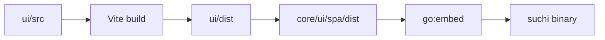

The primary UI is a Svelte 5 single-page application under `ui/`. Vite builds
static assets into `ui/dist`; `make ui` copies them to `core/ui/spa/dist`, where
Go embeds them into the Suchi binary.

Server-rendered pages remain only where they are useful before or outside the
application shell, such as bootstrap and direct preview or download responses.

## Source layout

```text
ui/src/
  App.svelte                  application shell and navigation
  app.css                     global tokens and component styles
  lib/api.js                  typed-by-convention API functions
  lib/i18n.js                 locale fallback and interpolation helper
  lib/net.js                  fetch and error handling
  lib/router.svelte.js        history and route state
  lib/session.svelte.js       current principal and session state
  lib/Lazy.svelte             route-level lazy loading
  lib/*.svelte                shared feature components
  routes/*.svelte             application screens
```

Keep route-specific state in its route. Shared state belongs in a small module
only when multiple routes genuinely coordinate through it. Suchi does not use a
general client cache or state framework; the server remains authoritative.

## Build and embedding



Use:

```sh
make ui        # install, build, and refresh embedded assets
make ui-check  # type checks, tests, build, and embedded-tree comparison
```

The built tree is committed so contributors changing only Go do not need a
JavaScript toolchain. A UI change is incomplete when `ui/dist` differs from the
embedded copy.

The beta build intentionally uses three JavaScript chunks: the shell, archive
workflows, and management workflows. At this revision they total about 260 KB
raw and 84 KB gzip. Treat this as a local bundle budget to remeasure after UI
changes, not a browser-memory or container-size claim.

## Routing and loading

`router.svelte.js` wraps browser history and exposes route state. `App.svelte`
selects the route component and owns the persistent navigation. Larger routes
load through `Lazy.svelte`, keeping the startup bundle small without splitting
every component into its own chunk.

New screens should use a stable path, support browser back and forward, and
have a useful narrow-screen layout. Avoid adding a second router or navigation
registry.

## API conventions

`net.js` owns fetch behavior, JSON errors, and session failures. `api.js` names
the product operations consumed by components. Route components should call
those helpers rather than duplicating URLs or response parsing.

The SPA uses the same documented endpoints as other clients:

| Area | Main API surfaces |
| --- | --- |
| Session and profile | `/api/login`, `/api/logout`, `/api/whoami`, `/api/users/me` |
| Documents | `/api/documents/`, document detail, preview, download, bulk edit |
| Search and views | `/api/search/`, `/api/autocomplete/`, `/api/saved_views/` |
| Taxonomy | JD categories, tags, correspondents, document types, custom fields |
| Work | automations, approvals, and durable tasks |
| Administration | setup state, settings, users, mail accounts, and LLM status |

The [API reference](/api) is authoritative for payloads and scopes. When a UI
needs a new server capability, add the endpoint contract and integration tests
before depending on it in a component.

## State and interaction

- Server responses are the source of truth for documents and settings.
- Session state is shared because every route needs the current principal.
- Upload progress uses the shared upload bus so navigation does not hide active
  work.
- Builder vocabularies come from their focused API endpoints, such as
  `/api/automations/schema`; local values only keep the editor usable while a
  request is unavailable.
- UI dictionaries use exact locale, base language, then English fallback. Add
  translations to the existing helper instead of introducing another runtime.
- Optimistic updates are limited to reversible interactions and must restore
  state on failure.

Use semantic controls, visible focus, labels for icon-only actions, and stable
dimensions for toolbars and repeated rows. Mobile layouts must preserve every
workflow rather than hiding administrative actions without an alternative.

## Security

The browser receives a session cookie; scripts do not read its value. Mutating
requests remain same-origin and pass Fetch Metadata protection on the server.
Preview content is served by dedicated endpoints under a restrictive CSP, not
injected into component HTML.

Render ordinary text through Svelte escaping. The only intentionally marked-up
search content is sanitized before display. Never store API tokens, mailbox
credentials, or provider keys in browser storage.

## Adding or changing a screen

1. Reuse or add an operation in `lib/api.js` and cover parsing behavior where
   it is non-trivial.
2. Put the screen in `routes/` and shared controls in `lib/`.
3. Add the route and navigation entry in the existing registries.
4. Cover loading, empty, error, and permission states.
5. Check desktop and mobile layouts, keyboard operation, and text overflow.
6. Run `make ui`, `make ui-check`, and the relevant API integration tests.

Keep dependencies rare. Svelte, Vite, and the existing icon approach cover the
current product; a new package should remove more maintained code than it adds.
