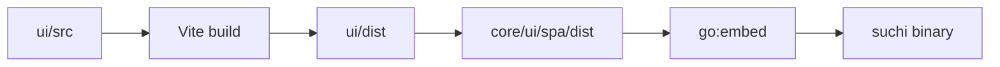

The primary UI is a Svelte 5 single-page application under `ui/`. Vite builds
static assets into `ui/dist`; `make ui` copies them to `core/ui/spa/dist`, where
Go embeds them into the Suchi binary.

Server-rendered pages remain only where they are useful before or outside the
application shell, such as bootstrap and direct preview or download responses.

## Source layout

```text
ui/src/
  App.svelte                  application shell and navigation
  app.css                     global tokens and component styles
  lib/api.js                  fetch, errors, and named API operations
  lib/configuration.js        setup and archive-setting labels
  lib/capabilities.js         member capability labels and checks
  lib/documentFilters.js      saved-view to browser-route translation
  lib/intelligence.js          intelligence type labels and value formatting
  lib/format.js               dates, sizes, and sensitivity vocabulary
  lib/net.js                  local endpoint validation
  lib/router.svelte.js        hash-route state
  lib/session.svelte.js       current principal and session state
  lib/Lazy.svelte             route-level lazy loading
  lib/*.svelte                shared feature components
  routes/*.svelte             application screens
```

Keep route-specific state in its route. Shared state belongs in a small module
only when multiple routes genuinely coordinate through it. Suchi does not use a
general client cache or state framework; the server remains authoritative.

## Build and embedding



Use:

```sh
make ui        # install, build, and refresh embedded assets
make ui-check  # type checks, tests, build, and embedded-tree comparison
```

The built tree is committed so contributors changing only Go do not need a
JavaScript toolchain. A UI change is incomplete when `ui/dist` differs from the
embedded copy.

Settings reads `build_version` and optional `build_revision` from the existing
`/api/whoami` session response. The executable supplies this identity once at
startup from release linker values or Go VCS metadata, not `ui/package.json`.
Do not add a separate frontend version, version request, or update checker.
Tagged production builds show only the version in Settings; development builds
also show the source revision. The CLI's `developmentVersion` owns the default
source version line when no release version was injected.

`App.svelte` imports each route directly through the existing `Lazy.svelte`
component. There are no route re-export wrappers. One native Rolldown group
combines small document controls, link display, clipboard/query helpers, and
upload-list refresh state; other shared dependencies use normal chunking.
The QR encoder remains a separate on-demand import. My account defers archive configuration and loads
mailbox code only for members who can manage mailboxes. Keep the shell at or
below 35 KB gzip and remeasure the actual route dependency set after UI changes.

Current production JavaScript sizes, measured with system `gzip -nc`. Route
rows include their static dependencies **in addition to the already loaded
shell**, with an otherwise empty cache:

| Entry | Raw bytes | Gzip bytes |
| --- | ---: | ---: |
| Shell: navigation, Dashboard, login | 95,644 | 34,687 |
| Documents / Inbox | 28,792 | 10,519 |
| Document detail | 35,118 | 12,219 |
| Upload | 13,112 | 5,964 |
| Search | 8,894 | 4,284 |
| Views | 14,629 | 5,290 |
| Calendar | 16,334 | 6,407 |
| Trash | 8,327 | 3,922 |
| Approvals | 18,351 | 6,576 |
| Automations | 17,940 | 5,955 |
| My account, without mailbox capability | 13,156 | 4,818 |
| Archive configuration, including its Settings entry | 107,746 | 35,639 |
| Setup | 66,511 | 22,155 |
| Demo | 5,578 | 2,339 |
| Archive research drawer | 13,763 | 5,282 |
| **All unique JavaScript chunks** | **390,165** | **138,601** |

The initial shell also transfers 5,219 gzip bytes of CSS. All CSS together is
22,145 gzip bytes. The complete embedded SPA tree is 483,137 raw bytes. Shared
chunks are cached across navigation; do not sum the route rows to estimate the
complete build. A mailbox-capable member additionally loads 10,511 gzip bytes
of mailbox JavaScript on My account.

Smaller route transfers trade some whole-build compression for not fetching
unrelated screens. These are transfer-size measurements, not browser memory
or startup-latency claims.

At the same source and dependency pins, grouping document controls reduces
unique JavaScript chunks from 24 to 21 and Documents' additional requests from
five to two. The initial shell remains one request. First visits to Upload,
Search, and Trash transfer roughly 1–2 KB more compressed controls, then reuse
that cached chunk. Heavy settings, research, and the QR encoder stay deferred.
`ui/src/bundle.test.js` builds the production graph in memory and checks the
35 KiB initial budget, document request count, deferred features, and static
dependency cycles. Production browser tests use
`PLAYWRIGHT_PRODUCTION=1 bun run e2e`; preview serves its built assets locally
and proxies only backend routes.

```sh
make ui
for asset in ui/dist/assets/*.js; do
  printf '%s ' "$asset"
  gzip -nc "$asset" | wc -c
done
```

## Routing and loading

`router.svelte.js` tracks the URL hash and exposes route state. `App.svelte`
selects the route component and owns the persistent navigation. Routes load
through `Lazy.svelte`; keep ordinary nested components together unless a
conditional feature would otherwise force unrelated code into the request.

New screens should use a stable path, support browser back and forward, and
have a useful narrow-screen layout. Avoid adding a second router or navigation
registry.

`Documents.svelte` derives Documents/Inbox pagination, filters, and date bounds
from the hash query. Page links preserve the current route and query; filter
controls remove `page`. There is no separate page-state cache. A bounded page
window keeps the footer compact on mobile. Invalid or out-of-range pages use
`go(hash, { replace: true })`, which replaces browser history and synchronizes
route state without creating a Back-button loop. Existing abort/version guards
discard stale list reads. Browser regressions cover history, reload, date/sort
state, Inbox scope, and shrinking result sets:
`cd ui && bun run e2e --grep 'document pagination|inbox pagination'`.

Trash links use the existing `#/doc/{id}` route. `DocumentDetail.svelte` uses
the server's `trashed_at`, `deletes_at`, and `owner_id` fields to show a read-only
recovery screen rather than a second document viewer. It skips versions,
similarity, and access-management requests while trashed. Restore reloads the
same document; confirmed permanent deletion returns to Trash. Blob access is
enforced by the server, not these UI conditions. Trash row links and recovery
buttons are separate semantic controls, with actions below the title on mobile.

Calendar links with `document_ids` open the same route's all-dates agenda;
ordinary `#/calendar` keeps the month grid and saved-View selector. Calendar's
`month` (`YYYY-MM`), `date` (`YYYY-MM-DD`), `view_id`, and `role` come from the hash
query. Day links open a full-width agenda and preserve the originating month,
View, and role for return navigation and reload. Exact-day reads use the existing
intelligence API with equal date bounds and `precision=day`; the server filters
before counting and paginating, rather than dropping partial dates in the UI.
Document-scoped research links still omit month bounds and reset stale scope
state. Day and all-dates agendas page through 500 facts at a time. See
[Document dates](/document-dates).

`lib/intelligence.js` formats date facts to their recorded day/month/year
precision for Calendar and Approvals. Month/year sorting placeholders stay out
of Calendar day cells. Agenda status details use native disclosure controls
for `LLM Classifier confidence: N%`, without custom interaction state.

Calendar serializes explicitly requested, reviewed exact-day events through
`lib/calendarExport.js` into local iCalendar downloads. It escapes text, folds
UTF-8 lines, and preserves an event identifier across repeated exports. A native
disclosure explains what leaves Suchi when the user imports the file. No API,
schema, subscription, or document-access changes are involved.

## API conventions

`api.js` owns fetch behavior, JSON errors, and the named product operations
consumed by components. `net.js` validates user-supplied local endpoints. Route
components should call API helpers rather than duplicating URLs or response
parsing.

The SPA uses the same documented endpoints as other clients:

| Area | Main API surfaces |
| --- | --- |
| Session and profile | `/api/login`, `/api/logout`, `/api/whoami`, `/api/users/me` |
| Documents | `/api/documents/`, document detail, preview, download, bulk edit |
| Search and views | `/api/search/`, `/api/autocomplete/`, `/api/saved_views/` |
| Taxonomy | JD categories, tags, correspondents, document types, custom fields |
| Work | automations, approvals, and durable tasks |
| Administration | setup state, settings, users, mail accounts, and LLM status |

The [API reference](/api) is authoritative for payloads and scopes. When a UI
needs a new server capability, add the endpoint contract and integration tests
before depending on it in a component.

## Interface wording

Product labels have one source in the frontend:

| Vocabulary | Source |
| --- | --- |
| Main navigation and page titles | `App.svelte` |
| Setup steps and Archive configuration sections | `lib/configuration.js` |
| Member capabilities | `lib/capabilities.js` |
| Sensitivity choices | `lib/format.js` |
| Document-list browser parameters | `lib/documentFilters.js` |
| Intelligence roles and values | `lib/intelligence.js` |

Components import these values instead of maintaining local copies. A wording
or behavior change must update [Web app](/web-app), the focused feature guide,
and its browser test in the same change. API field names can remain technical;
visible labels should use the terms documented in the Web app guide.

## State and interaction

- Server responses are the source of truth for documents and settings.
- Session state is shared because every route needs the current principal.
- Successful uploads increment a small shared revision so visible document
  lists can refresh in the same tab, including window-level drops. The shell
  ignores drops already handled by the upload dialog or Upload screen and hands
  other drops to its existing lazy Upload dialog. `UploadBox.svelte` owns picker,
  drop, and confirmed paste batches through one upload path. Accepted batches
  continue during in-app navigation while the account remains unchanged.
  Its unfinished post-processing task reads precede document reads, and polling
  timeouts stay explicit rather than declaring success. Poll timers and local
  paste-preview URLs are released when the component unmounts.
- Builder vocabularies come from their focused API endpoints, such as
  `/api/automations/schema`; local values only keep the editor usable while a
  request is unavailable.
- Optimistic updates are limited to reversible interactions and must restore
  state on failure.

Document and selection sharing publish the created URL before attempting
clipboard access. `lib/clipboard.js` reports whether copying succeeded; the
same URL stays selectable for manual copy. Late creation responses are ignored
after navigation or an account transition, including their clipboard effects.

`LinkQR.svelte` renders private document URLs and already-created share URLs with
a browser-local encoder loaded only when a QR is opened. It draws escaped SVG
attributes from the encoder matrix, not injected markup. QR generation has no
server endpoint, outbound request, persistence, or credential issuance. The
native document-link dialog keeps the normal authenticated document route;
share codes retain the existing link's access, expiry, and revocation rules.

Document detail expands and copies the full `content` already returned by its
authorized API read. High-sensitivity text stays behind Reveal, including manual
copy fallbacks. Copy failures provide a read-only text field; route/account
changes discard late feedback. No extraction or clipboard-read request is added.

Approval cards display decision context and deadlines without internal workflow
or assignee identifiers. Rescan proposals use an **Affected documents** disclosure
only when document links are available.

Use semantic controls, visible focus, labels for icon-only actions, and stable
dimensions for toolbars and repeated rows. Mobile layouts must preserve every
workflow rather than hiding administrative actions without an alternative.

## Security

All browser authentication uses HttpOnly cookies, including the anonymous demo
and its upgraded scratch session. The SPA does not read or persist credentials.
Concurrent demo writes share one upgrade request; signing out or signing in
invalidates pending reads/retries and cancels an unfinished upgrade.
The scratch session retains its restricted demo identity on both API and direct
resource requests. Cookie-authenticated mutations remain same-origin and pass
Fetch Metadata protection on the server.
Preview content is served by dedicated endpoints under a restrictive CSP, not
injected into component HTML.

Destructive confirmations use native modal dialogs for Escape, focus return,
and an inert background rather than a custom keyboard/focus manager.

Render ordinary text through Svelte escaping. The only intentionally marked-up
search content is sanitized before display. Do not extend browser token storage
to ordinary login, or store mailbox credentials or provider keys there.

## Adding or changing a screen

1. Reuse or add an operation in `lib/api.js` and cover parsing behavior where
   it is non-trivial.
2. Put the screen in `routes/` and shared controls in `lib/`.
3. Add the route and navigation entry in the existing registries.
4. Cover loading, empty, error, and permission states.
5. Check desktop and mobile layouts, keyboard operation, and text overflow.
6. Run `make ui`, `make ui-check`, and the relevant API integration tests.

Keep dependencies rare. Svelte, Vite, and the existing icon approach cover the
current product; a new package should remove more maintained code than it adds.
