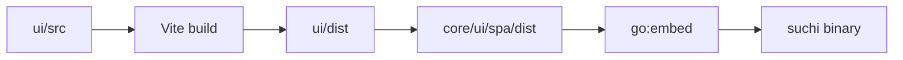

The primary UI is a Svelte 5 single-page application under `ui/`. Vite builds
static assets into `ui/dist`; `make ui` copies them to `core/ui/spa/dist`, where
Go embeds them into the Suchi binary.

Server-rendered pages remain only where they are useful before or outside the
application shell, such as bootstrap and direct preview or download responses.

## Source layout

```text
ui/src/
  App.svelte                  application shell and navigation
  app.css                     global tokens and component styles
  lib/api.js                  fetch, errors, and named API operations
  lib/system-routing.js       filing-system loading and route entry
  lib/configuration.js        setup and archive-setting labels
  lib/capabilities.js         member capability labels and checks
  lib/documentFilters.js      saved-view to browser-route translation
  lib/intelligence.js          intelligence type labels and value formatting
  lib/format.js               dates, sizes, and sensitivity vocabulary
  lib/net.js                  local endpoint validation
  lib/router.svelte.js        hash-route state
  lib/session.svelte.js       current principal and session state
  lib/systems.svelte.js       filing identity, accessible systems, request generation
  lib/Lazy.svelte             route-level lazy loading
  lib/*.svelte                shared feature components
  routes/*.svelte             application screens
```

Keep route-specific state in its route. Shared state belongs in a small module
only when multiple routes genuinely coordinate through it. Suchi does not use a
general client cache or state framework; the server remains authoritative.

## Build and embedding



Use:

```sh
make ui        # install, build, and refresh embedded assets
make ui-check  # type checks, tests, build, and embedded-tree comparison
```

The built tree is committed so contributors changing only Go do not need a
JavaScript toolchain. A UI change is incomplete when `ui/dist` differs from the
embedded copy.

Settings reads `build_version` and optional `build_revision` from the existing
`/api/whoami` session response. The executable supplies this identity once at
startup from release linker values or Go VCS metadata, not `ui/package.json`.
Do not add a separate frontend version, version request, or update checker.
Tagged production builds show only the version in Settings; development builds
also show the source revision. The CLI's `developmentVersion` owns the default
source version line when no release version was injected.

`App.svelte` loads every route, including login and dashboard, through the existing
`Lazy.svelte` component. There are no route re-export wrappers. A native Rolldown
group keeps the shell, API client, filing context and their static dependencies
together. A separate group combines small document controls, link display,
clipboard/query helpers, and upload-list refresh state; other shared dependencies
use normal chunking.
The shared password-unlock indicator belongs to this group and reads the
existing encryption state exposed by document list and detail responses.
The QR encoder remains a separate on-demand import. My account defers archive configuration and loads
mailbox code only for members who can manage mailboxes. The mobile pairing
prompt loads only after its button is selected; it keeps the single-use secret
in component memory, clears expired QR/link displays, and discards it on
navigation, account change or system switch. When the original session remains
available, unused and late-created codes are cancelled against their captured
system. Generation and clipboard writes check the original account and system;
late responses never display in another cabinet's prompt.
`AccountSettings.svelte` owns one active-token list and renders the current
account's `mobile_pairing` credentials in Mobile app through a shared row snippet;
manual and legacy credentials remain in API tokens. Token reads refresh every
two seconds only while the prompt is open, immediately on close, and on window
focus. Reads are bounded, abortable, ordered, and checked against their original
account+system generation; either change clears the list, and unmount stops polling.
Revocation reloads the list so an earlier poll cannot restore a disconnected app.
Keep the shell at or
below 35 KiB gzip and remeasure the actual route dependency set after UI changes.

Measure the current production graph rather than assuming historical route sizes.
Settings, research, and QR code generation remain deferred. Filing context lives
in the shell; the system membership editor loads with archive configuration.
Static assets are shared normally by the browser, not by an application cache.
`ui/src/bundle.test.js` builds the production graph in memory and checks the
35 KiB initial budget, document request count, deferred features, and static
dependency cycles. Production browser tests use
`PLAYWRIGHT_PRODUCTION=1 bun run e2e`; preview serves its built assets locally
and proxies only backend routes.

```sh
make ui
for asset in ui/dist/assets/*.js; do
  printf '%s ' "$asset"
  gzip -nc "$asset" | wc -c
done
```

## Routing and loading

`router.svelte.js` tracks the URL hash and exposes route state. `App.svelte`
selects the route component and owns the persistent navigation. Routes load
through `Lazy.svelte`; keep ordinary nested components together unless a
conditional feature would otherwise force unrelated code into the request.

New screens should use a stable path, support browser back and forward, and
have a useful narrow-screen layout. Avoid adding a second router or navigation
registry.

### Filing systems and request lifetimes

`systems.svelte.js` owns only the accessible list, introduced state, current code
and account+system request generation. `GET /api/jd/systems` is authoritative.
Before the first prefixed taxonomy import the list is empty and the existing
unprefixed UI/URLs remain unchanged. Introduction is not a browser preference
or an enable/disable control.

`App.svelte` waits for identity and the accessible list before mounting any
collection screen or requesting its tree/counters. For an unqualified route it
selects the accessible original system, otherwise the first enterable system,
and writes `system=CODE` into the hash before starting collection requests.
An explicitly unavailable system never falls back. With no memberships, the
shell explains that access must be granted and offers the existing profile
controls and sign-out without requesting document-bearing settings.

Numeric document routes without a system first load that document intrinsically.
The returned `system_code` binds the route/sidebar and subsequent metadata and
blob requests. Full-address searches use `/api/jd/resolve`; a stale address is
an error, not an alias or a broad text search. Document lists/detail display the
server-projected `jd_address`; the detail address and private numeric URL are
copyable. Existing category pickers remain two-level pickers within the cabinet.

`router.svelte.js` remains the sole hash router. Navigation and native links use
the scoped hash helper, so reload, Back/Forward, copied links and new tabs retain
context. A switch drops foreign filters and document IDs. The shell keys its
scoped subtree by generation and clears tree, counters, selections, reveal state,
upload/share/pairing/import/OAuth dialogs and parked research. Directory expansion
uses `suchi.jd.open.<user>.<system>`; theme remains a presentation-only preference.
Existing route abort/version guards remain in place.

API helpers capture complete scoped URLs before starting requests and reject
responses from older account/system generations. Single-flight GET keys include
the generation and full URL, never only an unqualified endpoint. Blob/export
helpers capture the same destination. A `system_unavailable` response clears the
active surface rather than presenting another cabinet. These browser guards
prevent stale display; the server remains responsible for authorization.
`system-routing.js` owns catalog refresh and route entry, using the existing API
helpers and their error handling. Dependencies are one-way:
`system-routing.js` → `api.js` → `systems.svelte.js`. The state module has no API
dependency; synchronous scope helpers stay there so transport and routing share
the same account/system generation checks without a circular import.

`SystemSettings.svelte` is visible to administrators only after introduction.
It edits the current system's display name and complete explicit membership set.
The existing all-user directory is paged in the browser, separately from that set;
off-page/inactive memberships are preserved until explicitly removed. Implicit
administrator access is displayed read-only and never manufactured as a grant.
Codes are permanent; there is no delete-system control. Filing configuration,
metadata, rules and mailboxes are scoped; identity, OCR/model settings, watched
folder configuration and backups remain visibly server-wide.

`Documents.svelte` derives Documents/Inbox pagination, filters, and date bounds
from the hash query. Page links preserve the current route and query; filter
controls remove `page`. There is no separate page-state cache. A bounded page
window keeps the footer compact on mobile. Invalid or out-of-range pages use
`go(hash, { replace: true })`, which replaces browser history and synchronizes
route state without creating a Back-button loop. Existing abort/version guards
discard stale list reads. Browser regressions cover history, reload, date/sort
state, Inbox scope, and shrinking result sets:
`cd ui && bun run e2e --grep 'document pagination|inbox pagination'`.

Trash links use the existing `#/doc/{id}` route. `DocumentDetail.svelte` uses
the server's `trashed_at`, `deletes_at`, and `owner_id` fields to show a read-only
recovery screen rather than a second document viewer. It skips versions,
similarity, and access-management requests while trashed. Restore reloads the
same document; confirmed permanent deletion returns to Trash. Blob access is
enforced by the server, not these UI conditions. Trash row links and recovery
buttons are separate semantic controls, with actions below the title on mobile.

Calendar links with `document_ids` open the same route's all-dates agenda;
ordinary `#/calendar` keeps the month grid and saved-View selector. Calendar's
`month` (`YYYY-MM`), `date` (`YYYY-MM-DD`), `view_id`, and `role` come from the hash
query. Day links open a full-width agenda and preserve the originating month,
View, and role for return navigation and reload. Exact-day reads use the existing
intelligence API with equal date bounds and `precision=day`; the server filters
before counting and paginating, rather than dropping partial dates in the UI.
Document-scoped research links still omit month bounds and reset stale scope
state. Day and all-dates agendas page through 500 facts at a time. See
[Document dates](/document-dates).

`App.svelte` uses `/api/whoami`'s `kind` (`demo-anon`/`demo-scratch`), not a
separate demo field, and separates Calendar visibility from extraction/review capability:
demo visitors see Calendar but gain no mutation or chat controls. Their default
Calendar opens the all-dates agenda so fixed fixtures remain discoverable over
time; explicit month/day URLs still work. `demo-corpus` entries show **Demo
example**, without model confidence or export controls. The tour offers real
Search and Calendar actions and labels Archive research as private-installation
only. Server authorization remains authoritative.

`lib/intelligence.js` formats date facts to their recorded day/month/year
precision for Calendar and Approvals. Month/year sorting placeholders stay out
of Calendar day cells. Agenda status details use native disclosure controls
for `LLM Classifier confidence: N%`, without custom interaction state.

Calendar serializes explicitly requested, reviewed exact-day events through
`lib/calendarExport.js` into local iCalendar downloads. It escapes text, folds
UTF-8 lines, and preserves an event identifier across repeated exports. A native
disclosure explains what leaves Suchi when the user imports the file. No API,
schema, subscription, or document-access changes are involved.

## API conventions

`api.js` owns fetch behavior, JSON errors, and the named product operations
consumed by components. `net.js` validates user-supplied local endpoints. Route
components should call API helpers rather than duplicating URLs or response
parsing.

The SPA uses the same documented endpoints as other clients:

| Area | Main API surfaces |
| --- | --- |
| Session and profile | `/api/login`, `/api/logout`, `/api/whoami`, `/api/users/me` |
| Documents | `/api/documents/`, document detail, preview, download, bulk edit |
| Search and views | `/api/search/`, `/api/autocomplete/`, `/api/saved_views/` |
| Taxonomy | JD categories, tags, correspondents, document types, custom fields |
| Work | automations, approvals, and durable tasks |
| Administration | setup state, settings, users, mail accounts, and LLM status |

The [API reference](/api) is authoritative for payloads and scopes. When a UI
needs a new server capability, add the endpoint contract and integration tests
before depending on it in a component.

`TaxonomyImport.svelte` is shared by setup's filing-tree step and Settings,
using the existing API helpers. It owns file/paste state, explicit HuML/TOML
selection, seed choice, remaps and preview freshness; it does not validate a
second schema in the browser. Late FileReader/network results cannot replace
new input, and conflicting actions are disabled in flight.

Preview presents the declared schema/content revision, source story, destination
code/name, named `user_areas`, separate System/49 `generated_areas`, category/rule
additions, preserved disabled rules and dependency skips. 00–09 is an explanatory
label, not a row. A first prefixed import alone offers “use this archive” versus
“create separately”, with an explicit code for preserving the original archive.
Content/format/seed/remap/destination changes invalidate preview; Apply carries
`expected_state_hash`. The browser does not copy its current code into a body
target, so opening S02 while viewing S01 correctly previews S02. A stale preview
preserves input and asks for another preview. Successful named Apply refreshes
the accessible list, selects the returned system, and invalidates the unnamed or
previous request generation. Blank confirmation and full/tree-only export stay
in this shared flow. Taxonomy administration remains session-admin web, not mobile
token access.

`lib/configuration.js` owns one section inventory. Setup steps derive their order,
keys, and labels from it, with only a shorter People label. `Setup.svelte` owns
step navigation/completion; `ArchiveSettings.svelte` owns the status overview and
section navigation, not configuration writes. Its sidebar and content share one
frame; narrow screens use a horizontally scrollable section rail.

`ConfigurationSection.svelte` owns the same form state, validation, required reads,
and writes for filing trees, watched folders, classification, and OCR/backups in
both surfaces. Required load keys drive both loading and error/retry gates.
Email editing delegates to `EmailAccounts.svelte`; filing-tree file previews and
application delegate to `TaxonomyImport.svelte`. Both automation entry points
link to `Automations.svelte` rather than maintaining another editor.

`PeopleSettings.svelte` keeps Users, Groups, Metadata, and Taxonomy in one
settings owner. Metadata uses a labeled type selector, including custom fields,
instead of nested tabs. File operations remain separate from metadata CRUD.
`UserCreateForm.svelte` owns user creation for both Settings and setup: labeled
fields, optional capability disclosure, validation/error state, and a form footer.
The shared form submits no member capabilities for an admin, preventing hidden
selections from taking effect if that account is later demoted.
It uses the existing API and shared capability labels; it adds no data cache,
router, or authorization layer. User/group scope and filing-system boundaries
remain unchanged.
The signed-in user's Active switch reads `session.user.user_id` and is read-only.

Verify the shared configuration flows with
`cd ui && bun run e2e --grep 'separates completed archive administration|refreshes intake owners|failed configuration reads'`.

## Interface wording

Product labels have one source in the frontend:

| Vocabulary | Source |
| --- | --- |
| Main navigation and page titles | `App.svelte` |
| Setup steps and Archive configuration sections | `lib/configuration.js` |
| Member capabilities | `lib/capabilities.js` |
| Sensitivity choices | `lib/format.js` |
| Document-list browser parameters | `lib/documentFilters.js` |
| Intelligence roles and values | `lib/intelligence.js` |

Components import these values instead of maintaining local copies. A wording
or behavior change must update [Web app](/web-app), the focused feature guide,
and its browser test in the same change. API field names can remain technical;
visible labels should use the terms documented in the Web app guide.

## State and interaction

- Server responses are the source of truth for documents and settings.
- Session state is shared because every route needs the current principal.
- Successful uploads increment a small shared revision so visible document
  lists can refresh in the same tab, including window-level drops. The shell
  ignores drops already handled by the upload dialog or Upload screen and hands
  other drops to its existing lazy Upload dialog. `UploadBox.svelte` owns picker,
  drop, and confirmed paste batches through one upload path. Accepted batches
  retain their immutable starting system during navigation while the account
  remains unchanged. A system switch never redirects remaining files; old receipts
  cannot increment the new system's refresh revision. Its unfinished processing
  task reads precede document reads. Unmount releases polling timers and local
  paste-preview URLs; timeouts remain explicit rather than declaring success.
- Builder vocabularies come from their focused API endpoints, such as
  `/api/automations/schema`; local values only keep the editor usable while a
  request is unavailable.
- Optimistic updates are limited to reversible interactions and must restore
  state on failure.

Document and selection sharing publish the created URL before attempting
clipboard access. `lib/clipboard.js` reports whether copying succeeded; the
same URL stays selectable for manual copy. Late creation responses are ignored
after navigation or an account transition, including their clipboard effects.

`LinkQR.svelte` renders private document URLs and already-created share URLs with
a browser-local encoder loaded only when a QR is opened. It draws escaped SVG
attributes from the encoder matrix, not injected markup. QR generation has no
server endpoint, outbound request, persistence, or credential issuance. The
native document-link dialog keeps the normal authenticated document route;
share codes retain the existing link's access, expiry, and revocation rules.

Document detail expands and copies the full `content` already returned by its
authorized API read. High-sensitivity text stays behind Reveal, including manual
copy fallbacks. Copy failures provide a read-only text field; route/account
changes discard late feedback. No extraction or clipboard-read request is added.

Mailbox OAuth flows and `sealed_secret_b64` handoffs exist only in the current
form's memory. Switching account/system destroys them; completion cannot reopen
a discarded form. The wire field is a server-sealed actor/system-bound handoff,
not a reusable copy of an at-rest mailbox credential.

Focused `filing systems` cases in `ui/tests/setup.spec.js` use controlled delayed
responses to exercise old-tree/counter/document and same-URL account races,
captured uploads, numeric deep links, address resolution, Back/reload, S02-only
entry, no-access profile controls, first-import selection, membership pagination,
name changes, pairing cancellation, share/OAuth invalidation and parked research.
These use the compiled browser and existing API fixtures; they are not evidence
of server isolation. Real-server/browser integration must additionally exercise
membership, document ACLs, delegated credentials and actual import/render work.

Approval cards display decision context and deadlines without internal workflow
or assignee identifiers. Rescan proposals use an **Affected documents** disclosure
only when document links are available.

Use semantic controls, visible focus, labels for icon-only actions, and stable
dimensions for toolbars and repeated rows. Mobile layouts must preserve every
workflow rather than hiding administrative actions without an alternative.

## Security

All browser authentication uses HttpOnly cookies, including the anonymous demo
and its upgraded scratch session. The SPA does not read or persist credentials.
Concurrent demo writes share one upgrade request; signing out or signing in
invalidates pending reads/retries and cancels an unfinished upgrade.
The scratch session retains its restricted demo identity on both API and direct
resource requests. Cookie-authenticated mutations remain same-origin and pass
Fetch Metadata protection on the server.
Preview content is served by dedicated endpoints under a restrictive CSP, not
injected into component HTML.

Destructive confirmations use native modal dialogs for Escape, focus return,
and an inert background rather than a custom keyboard/focus manager.

Render ordinary text through Svelte escaping. The only intentionally marked-up
search content is sanitized before display. Do not extend browser token storage
to ordinary login, or store mailbox credentials or provider keys there.

## Adding or changing a screen

1. Reuse or add an operation in `lib/api.js` and cover parsing behavior where
   it is non-trivial.
2. Put the screen in `routes/` and shared controls in `lib/`.
3. Add the route and navigation entry in the existing registries.
4. Cover loading, empty, error, and permission states.
5. Check desktop and mobile layouts, keyboard operation, and text overflow.
6. Run `make ui`, `make ui-check`, and the relevant API integration tests.

Keep dependencies rare. Svelte, Vite, and the existing icon approach cover the
current product; a new package should remove more maintained code than it adds.
