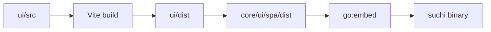

Suchi's primary UI is a Svelte 5 application under `ui/`, embedded in the Go
binary. Server-rendered pages cover bootstrap and direct preview/download
responses. This guide owns frontend implementation contracts; [Web app](/web-app)
owns user actions and labels, and the [API reference](/api) owns wire contracts.

## Source layout

```text
ui/src/
  App.svelte                  shell, navigation, route selection
  app.css                     global tokens and component styles
  lib/api.js                  transport, errors, named API operations
  lib/system-routing.js       filing-system catalog and route entry
  lib/router.svelte.js        sole hash router
  lib/session.svelte.js       principal, session, theme
  lib/systems.svelte.js       accessible systems and request generation
  lib/Lazy.svelte             deferred route/component loading
  lib/*.svelte                shared feature components
  routes/*.svelte             screen-owned state and behavior
```

Keep state in its screen unless multiple screens coordinate through it. Shared
modules remain small; there is no general client cache or state framework.
The [wording inventory](#interface-wording) identifies shared value helpers.

## Build and embedding



Use:

```sh
make ui        # install, build, and refresh embedded assets
make ui-check  # type checks, tests, build, and embedded-tree comparison
```

The built tree is committed so contributors changing only Go do not need a
JavaScript toolchain. A UI change is incomplete when `ui/dist` differs from the
embedded copy.

Settings reads `build_version` and optional `build_revision` from the existing
`/api/whoami` session response. The executable supplies this identity once at
startup through `app.Options` from release linker values or Go VCS metadata,
not `ui/package.json`. Shared server assembly does not change browser ownership,
routes, or the embedded bundle.
Do not add a separate frontend version, version request, or update checker.
Tagged production builds show only the version in Settings; development builds
also show the source revision. The CLI's `developmentVersion` owns the default
source version line when no release version was injected.

`App.svelte` loads every route, including login and dashboard, through the existing
`Lazy.svelte` component. There are no route re-export wrappers. A native Rolldown
group keeps the shell, API client, filing context and their static dependencies
together. A separate group combines small document controls, link display,
clipboard/query helpers, and upload-list refresh state; other shared dependencies
use normal chunking.
The shared password-unlock indicator belongs to this group and reads the
existing encryption state exposed by document list and detail responses.
The QR encoder remains a separate on-demand import. My account defers archive configuration and loads
mailbox code only for members who can manage mailboxes. The mobile pairing
prompt loads only after its button is selected; it keeps the single-use secret
in component memory, clears expired QR/link displays, and discards it on
navigation, account change or system switch. When the original session remains
available, unused and late-created codes are cancelled against their captured
system. Generation and clipboard writes check the original account and system;
late responses never display in another cabinet's prompt.
`AccountSettings.svelte` owns one active-token list and renders the current
account's `mobile_pairing` credentials in Mobile app through a shared row snippet;
manual and legacy credentials remain in API tokens. Token reads refresh every
two seconds only while the prompt is open, immediately on close, and on window
focus. Reads are bounded, abortable, ordered, and checked against their original
account+system generation; either change clears the list, and unmount stops polling.
Revocation reloads the list so an earlier poll cannot restore a disconnected app.
Keep the shell at or
below 35 KiB gzip and remeasure the actual route dependency set after UI changes.

Measure the current production graph rather than assuming historical route sizes.
Settings, research, and QR code generation remain deferred. Filing context lives
in the shell; the system membership editor loads with archive configuration.
Static assets are shared normally by the browser, not by an application cache.
`ui/src/bundle.test.js` builds the production graph in memory and checks the
35 KiB initial budget, document request count, deferred features, and static
dependency cycles. Production browser tests use
`PLAYWRIGHT_PRODUCTION=1 bun run e2e`; preview serves its built assets locally
and proxies only backend routes.

```sh
make ui
for asset in ui/dist/assets/*.js; do
  printf '%s ' "$asset"
  gzip -nc "$asset" | wc -c
done
```

## Routing and loading

`router.svelte.js` owns hash state; `App.svelte` chooses routes and persistent
navigation. Screens support reload, Back/Forward and narrow layouts through this
router, without a second navigation registry.

### Filing systems and request lifetimes

`GET /api/jd/systems` is authoritative. `systems.svelte.js` stores only its
accessible list, introduced state, current code and account/system generation.
Before first prefixed import, the empty list preserves unprefixed UI and URLs;
introduction is not a browser preference. [Filing systems](/jd) owns import and
storage semantics; [Permissions](/permissions) owns authorization.

`App.svelte` waits for identity and the catalog before mounting collection screens
or requesting tree/counters. An unqualified route selects the accessible original
system, otherwise the first enterable system, and writes `system=CODE` before
collection reads. An explicit unavailable system never falls back. No-access
screens offer profile/sign-out without document-bearing settings requests.

An unqualified numeric document link loads the authorized document intrinsically;
its returned `system_code` binds the route, sidebar and subsequent metadata/blob
requests. Full addresses use `/api/jd/resolve`; stale addresses are errors, never
aliases or broad searches. Display the server's `jd_address`; address and private
numeric links are copyable. Category pickers stay two-level within the system.

Native links and `go()` use the scoped hash helper. Switching drops foreign
filters/IDs and increments generation. The shell keys its scoped subtree by that
generation, clearing tree, counters, selections, Reveal, upload/share/pairing/
import/OAuth dialogs and parked research. Expansion state uses
`suchi.jd.open.<user>.<system>`; theme is presentation-only. Route abort/version
guards still reject superseded reads within one generation.

API helpers capture complete URLs before requests and reject older account/system
responses. Single-flight GET keys include generation and full URL. Blob links and
text taxonomy exports use the same captured destination; exports share transport,
logout guards and structured errors. A current-system `system_unavailable` clears
the surface. Continuing upload or pairing-cleanup errors from a previous system
cannot invalidate the current one. All new upload entry points, including window
drops, require the route's system to be ready.

Dependencies stay one-way: `system-routing.js` → `api.js` → `systems.svelte.js`.
Catalog refresh/route entry live in the first module; synchronous scope helpers
live in the last, which has no API dependency. Browser guards prevent stale
display; the server enforces access.

`SystemSettings.svelte` edits the current name and complete explicit membership
set for admins after introduction. Browser directory pages do not own that set:
off-page/inactive grants survive until removed explicitly. Admin access is implicit
and read-only; codes are permanent and there is no delete-system control. Filing
configuration, metadata, rules and mailboxes are scoped; identity, watched-folder
configuration, OCR/models and backups remain visibly server-wide.

Documents/Inbox derive filters, dates and pagination from the hash, without a page
cache. Links preserve route/query; filter controls remove `page`. A bounded footer
fits mobile. Invalid/out-of-range pages use `go(hash, { replace: true })` to sync
route state without creating Back-button loops. Verify with:
`cd ui && bun run e2e --grep 'document pagination|inbox pagination'`.

Trash uses `#/doc/{id}` and the same detail owner. Server `trashed_at`, `deletes_at`
and `owner_id` select read-only recovery; skip versions, similarity and access
management reads. Restore reloads that document; confirmed deletion returns to
Trash. Keep row links separate from recovery buttons, with actions below titles
on mobile. Server authorization still governs blobs.

Detail reloads only when its document ID changes or an explicit action requests
refresh. Arrival of sidebar categories must not restart reads or discard edits.
Metadata/language saves check that same document generation before updating local
state, so an earlier save cannot change the next document's sensitivity or Reveal.

Calendar derives `month`, `date`, `view_id`, `role` and document scope from the
hash. `document_ids` opens an all-dates agenda; ordinary routes use the month grid.
Day links preserve originating month/View/role. Exact-day requests use equal date
bounds and `precision=day`; filtering precedes server counts/pagination. Day and
all-dates agendas page by 500; research links omit month bounds and reset prior
scope. `lib/intelligence.js` preserves recorded precision; partial dates never
populate day cells. [Document dates](/document-dates) owns review/display behavior.

Calendar exports use `lib/calendarExport.js` for explicitly requested, reviewed
exact-day `.ics` files: escape text, fold UTF-8 lines, preserve stable event IDs
and disclose the exported contents. This adds no subscription or authority.

Demo eligibility comes from `whoami.kind` (`demo-anon`/`demo-scratch`). Calendar
remains visible without mutation/research access; default demo Calendar opens
all dates, while explicit month/day links work. Curated `demo-corpus` entries omit
confidence/export controls. Public `/api/demo/mode` survives initial filing-state
reset but obeys session revision cancellation, allowing cookie minting and the
first-visit tour. The tour links real Search/Calendar and labels research as
private-installation only.

## API conventions

Components call named `api.js` operations, which own fetch and error parsing;
`net.js` handles local-endpoint validation. Add and test new server contracts
before using them in a screen. API field names may stay technical; visible labels
follow [Web app](/web-app).

`TaxonomyImport.svelte` is shared by the Filing tree and Taxonomy sections. It owns file/paste reads,
HuML/TOML choice, seed/remap/destination choices and preview freshness; schema
validation stays server-side. Late FileReader/network responses cannot replace
new input, and conflicting actions are disabled in flight.

Preview renders the declared schema/content revision, source story, destination,
`user_areas`, separate System/49 `generated_areas`, additions, preserved disabled
rules and dependency skips. 00–09 is explanatory, not a row. First prefixed import
offers using the original archive or preserving it under an explicit other code.
Changing content/format/seeds/remaps/destination invalidates preview. Apply sends
`expected_state_hash`, never a body target copied from current browser scope;
stale previews preserve input. Named success refreshes the catalog, selects the
returned system and invalidates old requests. Blank confirmation and explicit
full/tree-only exports stay in this shared flow. Taxonomy administration requires
a web admin session; mobile tokens cannot use it. See [Filing trees](/jd).

`lib/configuration.js` owns the Archive Configuration section inventory.
`ArchiveSettings.svelte` owns overview and section navigation.
`Settings.svelte` fills the shell's remaining dynamic viewport height, keeping
Settings tabs and the build footer outside its scrolling content row.
The archive frame fills that row: its right pane scrolls independently with a
stable scrollbar gutter. The sidebar can scroll in shorter windows and becomes
a horizontal section rail on narrow screens.

`App.svelte` owns the administrator's filing-tree reminder state.
`SetupReminder.svelte` renders it in the sidebar, narrow Dashboard and Settings.
Failures remain visible with Retry. Choosing a preset, confirmed Blank, or an
imported tree refreshes the state; visiting Filing tree alone does not dismiss it.

`ConfigurationSection.svelte` shares form state, validation, required-load/retry
gates and writes across Archive Configuration sections. Mailbox editing delegates to
`EmailAccounts.svelte`, imports to `TaxonomyImport.svelte`, and both automation
entry points link to the existing `Automations.svelte` editor.

Classification uses one shared **Classification options** block in both shells.
Its checked-by-default **Automatically apply high-confidence suggestions**
checkbox saves independently through **Save application mode**, using a standalone
`auto_apply` PATCH. Turning it off selects review-first behavior.
Model activation, local matching and research settings retain their own saves;
one save must not overwrite another form's saved or unsaved state. Automatic-only
threshold sliders are disabled, not cleared, in review mode. The connection test
validates a synthetic response without changing application mode.

`PeopleSettings.svelte` owns Users, Groups, Metadata and Taxonomy. Metadata has
one type selector including custom fields; file operations stay separate.
`UserCreateForm.svelte` owns user creation there and submits no hidden member
capabilities for admins. Self-disable checks use
`session.user.user_id`; the API owns self-disable, last-admin and capability
normalization safeguards. Verify shared configuration with:
`cd ui && bun run e2e --grep 'archive setup|filing-tree|refreshes intake owners|failed configuration reads'`.

`AccountSettings.svelte` sends only `display_name` for profile saves; sign-in email
is read-only. One token list separates owned `mobile_pairing` rows from manual/
legacy credentials. Reads are ordered, abortable, bounded, generation-checked and
refresh every two seconds while pairing is open, on close and on window focus.
Account/system changes clear the list; unmount stops polling; revoke reloads so
older polls cannot restore a credential. Demo kinds receive a read-only profile
without token, vault, mailbox or pairing controls or requests.

## Interface wording

| Vocabulary | Source |
| --- | --- |
| Navigation and titles | `App.svelte` |
| Archive Configuration sections | `lib/configuration.js` |
| Capabilities | `lib/capabilities.js` |
| Dates, sizes, sensitivity | `lib/format.js` |
| Saved-view filters and browser parameters | `lib/documentFilters.js` |
| Intelligence roles/values | `lib/intelligence.js` |

Import shared values instead of duplicating them. Update the owning feature guide,
[Web app](/web-app) and relevant browser regression when labels/behavior change.

## State and interaction

`UploadBox.svelte` owns picker, drop and confirmed paste batches through one path.
The shell ignores drops handled by the dialog/Upload screen. Accepted batches
keep their starting system across navigation while the account remains unchanged;
old receipts cannot advance the new system's upload-refresh revision. Processing
task reads precede document reads. Unmount releases polling timers and local paste
URLs; timeouts pause checks without claiming completion.

Share creation displays its URL before clipboard access. `lib/clipboard.js`
reports failures so that URL stays manually selectable. Late creation/copy feedback
is discarded after navigation/account changes. `LinkQR.svelte` lazily encodes
private or existing shared links locally with escaped SVG matrix attributes;
it issues no request, credential or new share. Document-detail full-text controls
use already-authorized `content`, retaining Reveal for sensitive text and a
selectable fallback when copying fails.

Pairing secrets stay in component memory; QR/link displays disappear on expiry.
Navigation/account/system changes discard them and cancel against their captured
system when the original session remains. Late-created codes are cancelled too;
generation/clipboard actions check
the originating account/system. Mailbox OAuth flow and `sealed_secret_b64` handoff
state also die with the form. The latter is a server-sealed actor/system-bound
creation handoff, not a copy of the at-rest credential.

Vocabularies come from focused endpoints; local fallbacks keep forms usable without
becoming authoritative. Reversible optimistic changes restore state on failure.
Use semantic controls, visible focus, icon labels and stable responsive layouts.
Approval cards show decision context, not internal IDs; rescan document links live
under **Affected documents**. [Web app](/web-app) owns remaining interaction detail.

`Tasks.svelte` and `lib/intelligence.js` consume bounded server projections:
proposed/current values, reasons, source freshness and permitted known actions.
Producer/score details are disclosures, not authority badges. Hidden supporters
are omitted server-side; sensitive quotes require local Reveal. Unknown actions
stay read-only, stale dates cannot be accepted, and supported stale suggestions
can be dismissed. Metadata resolution reports queued work rather than claiming
the field changed. Date mutation results clear only successful rows; failures
remain distinguishable and refreshable.

`Calendar.svelte` preserves accepted facts and distinguishes reviewed, automatic
and previously accepted legacy values. **Automatic** requires accepted status,
no human review and `policy_version=threshold-auto-v1`; missing reviewer alone
is not enough. New inference follows current mode and threshold, never a bulk
promotion on settings save. Local ICS export remains reviewed-only and exact-day.
These screens reuse the existing tasks, intelligence and document APIs.

## Security

Login/demo authentication uses HttpOnly cookies. The SPA does not persist session,
mailbox or provider credentials; freshly issued tokens/pairing secrets remain in
memory for their explicit handoff. Concurrent demo writes share one upgrade;
login/logout invalidate reads/retries and abort unfinished upgrades. Scratch
identity remains restricted for API and direct resources. Cookie mutations pass
server same-origin/Fetch Metadata checks.

Serve previews through dedicated endpoints with restrictive CSP. Render ordinary
text through Svelte escaping; sanitize marked-up search snippets before display.
Destructive confirmations use native dialogs for Escape, focus return and inert
backgrounds. Browser visibility never substitutes for server authorization.

## Adding or changing a screen

1. Reuse named API operations, existing route registries and shared controls.
2. Keep screen state in `routes/`; cover loading, empty, failure and permission states.
3. Check desktop/mobile, keyboard behavior and text overflow.
4. Update the owning user/architecture guide and run relevant API integration tests.
5. Run `make ui` and `make ui-check`; commit the embedded assets.

Keep dependencies rare; a package should remove more maintained code than it adds.
Additional verification:

```sh
cd ui
bun run check
bun test src
bun run e2e --grep 'filing systems'
PLAYWRIGHT_PRODUCTION=1 bun run e2e
```

Production preview serves built assets and proxies backend routes only. The
controlled-response `filing systems` cases cover delayed reads, account races,
captured uploads, deep links/history, no-access controls, first import, membership
paging/name changes, pairing/share/OAuth cleanup and parked research. These verify
compiled browser lifetimes, not server isolation: real-server checks must also
exercise membership, document ACLs, delegated credentials and import/render work.
