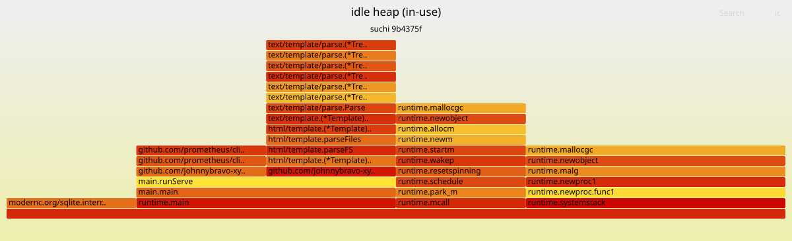

# suchi bench harness

Repeatable, single-machine benchmarks for a single suchi binary. Every
scenario boots a fresh temp datadir, exercises one axis (binary size,
idle RAM, cold start, single large ingest, corpus ingest, or concurrent
users), and drops JSONL samples + a per-scenario `*.summary.json` into a
timestamped results directory. A Go reporter then rolls the artefacts up
into a single Markdown summary.

## How to run

```
make build
cd hack/bench
./bench.sh
```

The driver:

1. Creates `hack/bench/results/YYYYMMDD-HHMMSS/`.
2. Builds the sampler / gen-pdf / report Go tools into
   `hack/bench/tools/*/bin/` (skipped when the binary is newer than
   `main.go`).
3. Runs each scenario in its own subshell, in order.
4. Runs `report -dir <results> -out summary.md` at the end.

### Common flags

- `./bench.sh --scenario 04` — run only `04-single-100mb.sh`.
- `./bench.sh --keep` — skip datadir cleanup after each scenario;
  useful for post-mortem inspection of the SQLite DB or logs.
- `./bench.sh --no-dev` — accepted for backward compat; no effect. The
  harness scrapes the setup token from the log at `LOG_LEVEL=warn` and
  never depends on dev mode.

### Scenario-specific env

- Scenario 06: `USERS` (default 10), `DOCS_PER_USER` (default 20).

## What each scenario measures

| # | Name                 | Measures                                                                 |
|---|----------------------|--------------------------------------------------------------------------|
| 01| binary-size          | `dist/suchi` byte size and embedded SPA byte size.                        |
| 02| idle-ram             | 60s of RSS/CPU/threads on an empty, freshly-bootstrapped instance.        |
| 03| cold-start           | Wall time from `serve` fork to first 200 on `/healthz`.                   |
| 04| single-100mb         | End-to-end upload + postingest for one 100 MB PDF; peak RSS during.       |
| 05| 1k-corpus            | Ingest throughput for 1000 x 50KB PDFs, plus five `/api/documents/` timings.|
| 06| concurrent-users     | N users x K uploads in parallel; p50/p95/p99 upload latency + throughput. |
| 07| mem-profile          | Heap + goroutine pprof at idle and after a 10 x 200KB burst; top-10 allocators + flame-graph SVGs. |

### Scenario 07 flame-graph outputs

For each of the two heap snapshots (idle, post-burst), scenario 07 renders
two interactive flame-graph SVGs into `results/<ts>/`:

- `07-flame-idle-inuse.svg` — live objects at idle steady-state.
- `07-flame-idle-alloc.svg` — cumulative allocation bytes since process start,
  captured at idle. Useful for spotting churn even when in-use is small.
- `07-flame-postburst-inuse.svg` — live objects after the 10 x 200KB burst
  has drained through post-ingest.
- `07-flame-postburst-alloc.svg` — cumulative allocation bytes across the
  full boot + burst window.

Diffing the two `inuse` graphs isolates ingest-path resident allocations
from the always-on baseline; diffing the two `alloc` graphs highlights
which ingest call sites churn the most bytes.

## Latest published numbers

The accepted v0.1 beta audit snapshot is in `latest-published/summary.md`.

| Scenario       | Metric                         | Value   |
| -------------- | ------------------------------ | ------- |
| 01 binary-size | stripped binary                | 27.7 MB |
| 02 idle-ram    | steady-state RSS median        | 36.0 MB |
| 03 cold-start  | time to `/healthz`              | 87 ms   |
| 06 concurrent  | 10 users × 5 uploads throughput | 454.5/s |
| 06 concurrent  | upload p95 / peak RSS           | 17 ms / 53.3 MB |

## Hardware fingerprint

Before quoting any number publicly, capture the host it came from:

```
uname -a
head -1 /proc/cpuinfo
grep MemTotal /proc/meminfo
```

Paste all three lines alongside the number.

## Notes

- **Linux-only sampler.** The Go sampler reads `/proc/<pid>/stat` and
  `/proc/<pid>/status`. It won't produce meaningful output on macOS or
  Windows. Everything else in the harness is portable bash, but leave
  the numbers to Linux hosts.
- **Teardown is safe.** Every scenario boots into an `mktemp -d` under
  `/tmp/`. Teardown hard-asserts the path starts with `/tmp/` before
  any `rm -rf`. Signals target the captured `SUCHI_PID` only — never a
  bare `pkill suchi`.
- **No CI integration.** These benchmarks are for maintainer-run
  sanity checks and public claims. They exercise a real network stack,
  a real SQLite DB, and a real Go binary — they're not fast or
  hermetic enough for per-PR gating, and that's on purpose.
- **Scenario isolation.** Each scenario runs in a `( subshell )` and
  owns its own boot + teardown pair. A failure in scenario N does not
  prevent scenario N+1 from running.
- **Scenario 07 prerequisites.** Requires `SUCHI_PPROF=1` (the script
  exports it before boot, so the runtime must honour that env var to
  expose `/debug/pprof/*`) and `go` on `PATH` for the `go tool pprof`
  post-processing step.

## Flame graphs

Scenario 07 renders each heap pprof into an interactive SVG flame graph.
Open the file in a browser (or click through on the GitHub blob view):
each box is a stack frame, width is proportional to the sample metric
(in-use bytes for `-inuse`, cumulative allocated bytes for `-alloc`),
click a box to zoom into that subtree, hover for the fully-qualified
symbol, `Ctrl-F` searches.

Published sample flame graph (curated snapshot at
`latest-published/`, refreshed by hand when a maintainer accepts a
run — the timestamped `results/` tree is gitignored so links from
docs would 404):



Also on disk in `latest-published/`:
- `07-flame-idle-alloc.svg` — cumulative allocation bytes at idle
  (bigger view; shows churn even after GC).
- `07-flame-postburst-inuse.svg` — live heap after ingesting 10 x
  200 KB PDFs; used to spot allocations retained beyond the burst.

## Alternative: local interactive exploration

Skip the SVG pipeline entirely — Go ships an interactive pprof
web UI with a native flame-graph view (Menu → VIEW → Flame Graph):

```
go tool pprof -http=:0 hack/bench/results/<ts>/07-heap-idle.pprof
```

Zero vendored deps, official Go tooling, better for one-off dev
sessions. The SVG pipeline is what feeds embeddable snapshots into
docs; the `-http` flow is what you reach for when actually
investigating a regression.

For sharing a profile: drop the `.pprof` into
[`speedscope.app`](https://speedscope.app) — client-side JS, no
uploads leave the browser, best UX for handing a snapshot to a
teammate.

Rendering pipeline:

1. `curl /debug/pprof/heap` → `.pprof` binary (already captured by
   scenario 07).
2. `pprof2collapsed -in <pprof> -sample_index <col>` — vendored Go tool
   in `tools/pprof2collapsed/`; folds pprof samples into Brendan Gregg's
   collapsed-stack format (`func1;func2;func3 <bytes>`).
3. `flamegraph.pl` — vendored under `tools/flamegraph/`; consumes the
   collapsed stream and emits interactive SVG.

Perl is a soft dep: if `perl` isn't on `PATH` (or either vendored piece
is missing), scenario 07 skips the SVG step and still emits pprof + top-N
tables. To pre-build the tools without running a scenario:

```
source hack/bench/lib.sh
bench_build_flame_deps
bench_render_flame results/<ts>/07-heap-idle.pprof /tmp/flame.svg inuse_space "idle heap"
```

Attribution: flame graphs are rendered by Brendan Gregg's
[`flamegraph.pl`](https://github.com/brendangregg/FlameGraph) (CDDL-1.0,
vendored under `tools/flamegraph/`; see `tools/flamegraph/LICENSE-flamegraph`).
